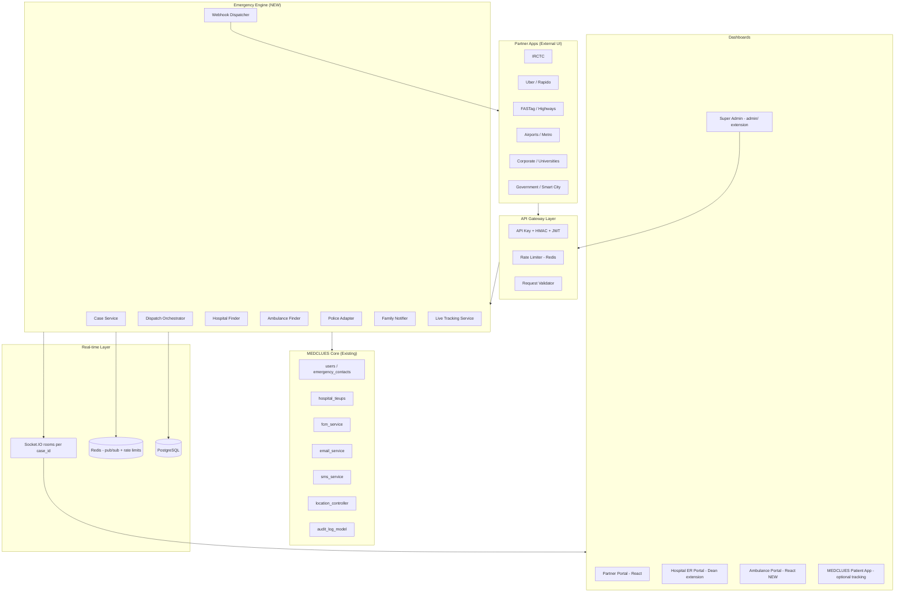
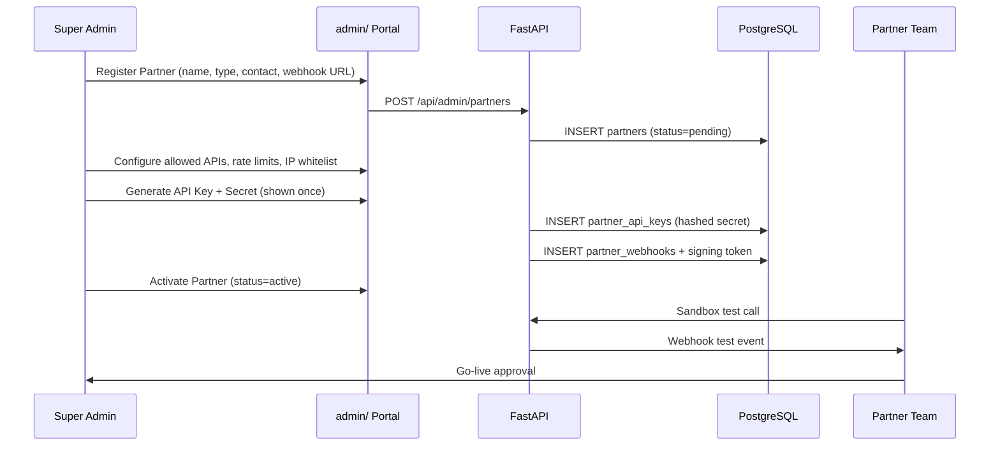
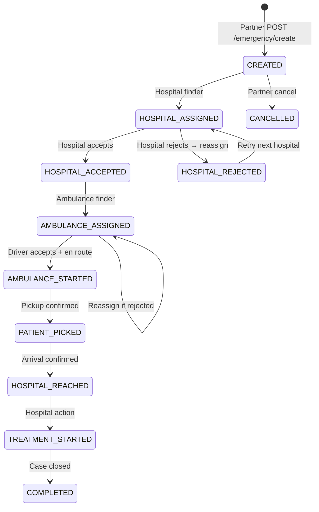
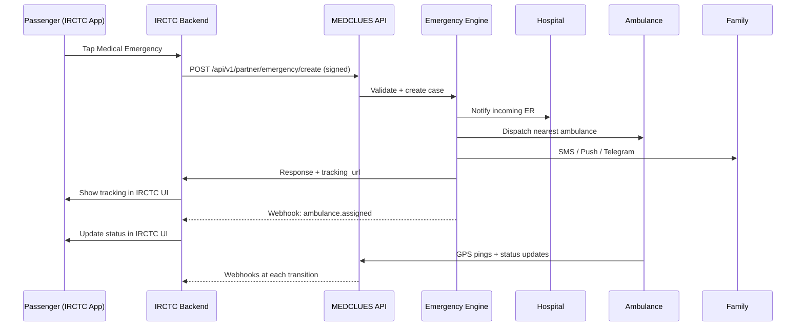
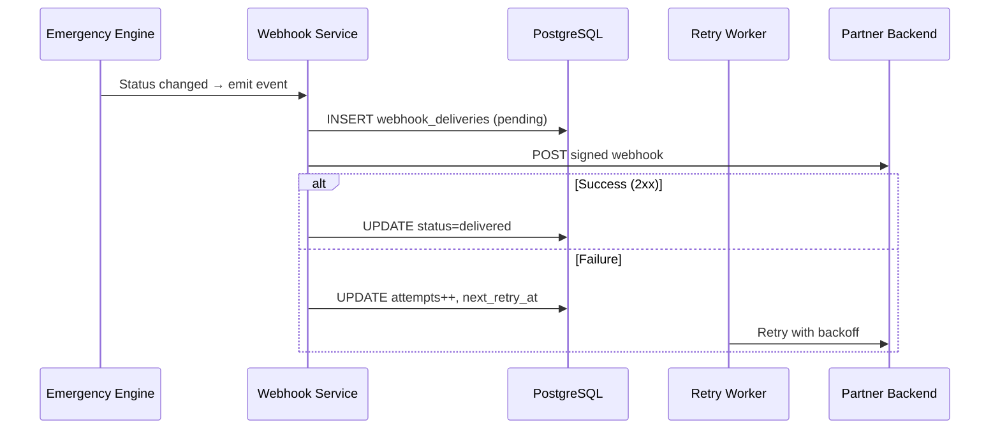
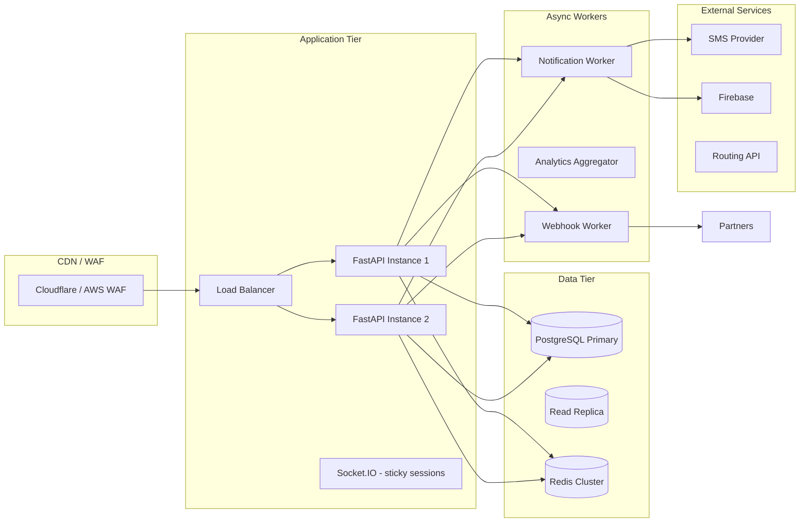

# MEDCLUES Emergency Partner Platform

**Architecture & Implementation Guide**

MEDCLUES Emergency Partner Platform allows third-party applications — IRCTC, Uber, Rapido, FASTag, Metro, Airlines, Corporate Campuses, Universities, Smart Cities, and Government Applications — to integrate with MEDCLUES through secure APIs.

**Core objective:** MEDCLUES becomes the central Emergency Response Platform. Partner applications keep their own UI; MEDCLUES handles the complete emergency workflow end-to-end.

---

## Table of Contents

1. [Integration Principle](#integration-principle)
2. [Section A — Overall System Architecture](#section-a--overall-system-architecture)
3. [Section B — Partner Registration Workflow](#section-b--partner-registration-workflow)
4. [Section C — Partner Dashboard Design](#section-c--partner-dashboard-design)
5. [Section D — Hospital Dashboard Design](#section-d--hospital-dashboard-design)
6. [Section E — Ambulance Dashboard Design](#section-e--ambulance-dashboard-design)
7. [Section F — Patient App Workflow](#section-f--patient-app-workflow)
8. [Section G — Emergency Workflow](#section-g--emergency-workflow)
9. [Section H — Database Schema](#section-h--database-schema)
10. [Section I — API Design](#section-i--api-design)
11. [Section J — Webhook Design](#section-j--webhook-design)
12. [Section K — Authentication & Security](#section-k--authentication--security)
13. [Section L — Billing & Subscription Model](#section-l--billing--subscription-model)
14. [Section M — Analytics Dashboard](#section-m--analytics-dashboard)
15. [Section N — UI/UX Wireframes](#section-n--uiux-wireframes)
16. [Section O — Sequence Diagrams](#section-o--sequence-diagrams)
17. [Section P — Deployment Architecture](#section-p--deployment-architecture)
18. [Section Q — Testing Strategy](#section-q--testing-strategy)
19. [Section R — Future Enhancements](#section-r--future-enhancements)
20. [Implementation Phases](#implementation-phases)
21. [Reuse vs Build New](#reuse-vs-build-new)
22. [Current MEDCLUES Baseline](#current-medclues-baseline)

---

## Integration Principle

This platform is designed to integrate with the existing MEDCLUES codebase **without affecting** current patient, doctor, dean, receptionist, or admin appointment workflows.

| Keep unchanged | Add as new module |
|----------------|-------------------|
| `/api/auth`, `/api/user`, appointments, video consult | `/api/v1/partner/*` |
| `/api/emergency/send-alert`, `/api/emergency/log-event` (patient SOS) | Emergency **Case Engine** (formal dispatch) |
| `hospital_tieups`, dean/reception portals | Partner org registry + API keys |
| Existing JWT roles (patient, doctor, dean, reception, admin) | New roles: `partner_admin`, `ambulance_operator`, `ems_dispatcher` |
| Flutter emergency module (optional upgrade path) | Partner apps use **their own UI** via API only |

**Rule:** Partner emergencies create records in **new tables** (`emergency_cases`), optionally link to `users` if the patient is a MEDCLUES user, and optionally log to `emergency_events` for audit — but never replace the existing SOS endpoints.

---

## Platform Flow Overview

```
Partner Apps (IRCTC, Uber, Rapido, FASTag, Airports, Metro, Universities, Corporate, Smart Cities, Government)
        ↓
MEDCLUES Emergency Platform
        ↓
Emergency Engine
        ↓
Hospital Finder → Ambulance Finder → Police Integration → Family Notification → Live Tracking
        ↓
Hospital Dashboard | Ambulance Dashboard | Partner Dashboard | Emergency Analytics
```

---

## Section A — Overall System Architecture



### Recommended Backend Layout

Mirrors the existing `routes → controllers → services → models` pattern in `fastapi_back/`:

```
fastapi_back/app/
├── routes/
│   ├── partner_emergency_routes.py    # /api/v1/partner/*
│   ├── partner_admin_routes.py        # Super admin partner CRUD
│   └── dispatch_routes.py             # Hospital + ambulance dashboards
├── controllers/
│   └── dispatch_controller.py
├── services/
│   ├── emergency_case_service.py      # State machine
│   ├── dispatch_orchestrator.py       # Find hospital/ambulance, notify all
│   ├── partner_auth_service.py        # API key, HMAC, IP whitelist
│   ├── partner_webhook_service.py     # Outbound signed webhooks
│   ├── ambulance_finder_service.py
│   ├── hospital_finder_service.py     # Extends location_controller
│   └── tracking_service.py            # GPS ingest + ETA
├── models/
│   ├── partner_model.py
│   ├── emergency_case_model.py
│   ├── ambulance_model.py
│   └── ...
└── middleware/
    └── partner_auth.py                # Separate from auth_user JWT
```

Mount in `main.py` alongside existing routers — **no changes** to appointment routes.

---

## Section B — Partner Registration Workflow

### Super Admin Capabilities

Super Admin can:

- Register Partner
- Edit Partner
- Disable Partner
- Delete Partner (soft delete)
- Generate API Keys
- Generate Secret Keys
- Generate Webhook Tokens
- Set API Rate Limits
- View Partner Analytics
- View API Usage
- View Billing

### Partner Details

| Field | Description |
|-------|-------------|
| Partner Name | Display name |
| Partner Type | See [Partner Types](#partner-types) |
| Contact Person | Primary contact |
| Email | Contact email |
| Phone | Contact phone |
| Webhook URL | Outbound event destination |
| API Key | Public identifier |
| Secret Key | HMAC signing secret (hashed at rest) |
| Allowed APIs | Scoped endpoint permissions |
| Allowed Domains | CORS / redirect allowlist |
| Status | `pending`, `active`, `suspended`, `disabled` |

### Partner Types

- IRCTC
- Uber
- Rapido
- FASTag
- Airports
- Metro
- Universities
- Corporate
- Government
- Custom Partners

### Registration Sequence



### Onboarding States

1. **Sandbox** — test keys, mock hospitals/ambulances
2. **Production** — live dispatch after partner certification

---

## Section C — Partner Dashboard Design

**Location:** `admin/src/pages/Partner/` (or separate subdomain `partners.medclues.in`)

### Dashboard Widgets

| Widget | Data Source |
|--------|-------------|
| Today's Emergency Requests | `emergency_cases WHERE partner_id AND created_at >= today` |
| Successful Requests | Terminal success states |
| Failed Requests | API 4xx/5xx in `api_logs` |
| Average Response Time | `first_ambulance_assigned_at - created_at` |
| Nearest Hospitals Served | Join `emergency_cases` → `hospital_tieups` |
| Ambulances Assigned | `ambulance_assignments` count |
| Family Notifications | `family_notifications` delivery status |
| API Usage | `api_logs` aggregated by endpoint |
| Webhook Status | Last delivery success/fail + retry queue depth |
| Billing | `billing` monthly rollup |
| Logs | Searchable `api_logs` + webhook delivery logs |

### Partner Authentication

Partner dashboard users authenticate with **JWT** (`role: partner_admin`, claim `partner_id`) — separate from patient/doctor JWT, same `token_service.py` pattern as dean's `hospital_id` scoping.

---

## Section D — Hospital Dashboard Design

**Location:** Extend Dean portal at `admin/src/pages/Dean/` with an **ER Dispatch** tab — scoped by existing `hospital_id` in JWT.

### Incoming Emergency Card

- Emergency ID
- Patient name / phone
- Location map pin
- Distance and ETA
- Partner source badge (IRCTC / Uber / etc.)
- Partner context (PNR, coach, ride ID — from `partner_metadata` JSONB)

### Hospital Actions

| Action | Description |
|--------|-------------|
| Accept | Acknowledge incoming emergency |
| Reject | Reject with reason → triggers reassignment |
| Assign Doctor | Reuse existing `doctors` table |
| Reserve Bed | ER bed reservation flag on case |
| Start Treatment | Mark treatment in progress |
| Treatment Completed | Close clinical phase |

### Notifications

Extend `fcm_service` with type `er_incoming_emergency`; notify on-duty doctors at that hospital.

**Important:** This is **additive** — existing dean appointment management stays untouched.

---

## Section E — Ambulance Dashboard Design

**Location:** New portal at `admin/src/pages/Ambulance/` with role `ambulance_operator`.

### Views & Features

| View | Features |
|------|----------|
| Nearby emergencies | Geo query on open cases within radius |
| Case detail | Patient, hospital destination, partner metadata |
| Accept / Reject | Assignment workflow |
| Navigation | Maps deep link |
| Pickup completed | Status transition |
| Hospital reached | Status transition |
| Live GPS | App sends `POST /api/v1/dispatch/location` every 10–15s |

### Ambulance Fleet Model (New)

**`ambulances`**
- `vehicle_number`, `type` (BLS/ALS), `base_lat/lng`, `status` (available/busy/offline)

**`ambulance_operators`**
- Linked to partner org or independent EMS company

**`ambulance_assignments`**
- `case_id`, `ambulance_id`, `status`, timestamps

### Real-time Updates

Reuse the **Socket.IO** pattern from `socket_service.py` — emit to room `case:{emergency_id}` on every status change.

---

## Section F — Patient App Workflow

Partner apps **do not use** the MEDCLUES patient UI for triggering emergencies. Tracking can be offered two ways:

1. **Tracking URL** — returned in partner API response → public web page (`frontend/src/pages/EmergencyTrack.jsx`) — no login required, token in URL
2. **MEDCLUES app** — if patient phone matches a `users` record, deep link opens case timeline in Flutter `features/emergency/`

### Patient Tracking Page

- Emergency ID
- Current status
- Current location
- Hospital assigned
- Ambulance ETA
- Emergency timeline
- Live map

### Live Update Recipients

All stakeholders receive live updates:

- Patient
- Family
- Hospital
- Partner
- Ambulance

Existing Flutter emergency module continues to work for **direct SOS**; optionally later it can call the same Case Engine internally.

---

## Section G — Emergency Workflow

### Example: IRCTC Medical Emergency

1. Passenger presses **Medical Emergency** inside IRCTC app
2. IRCTC sends `POST /api/v1/partner/emergency/create`
3. MEDCLUES processes the full workflow
4. Response returned with Emergency ID, hospital, ETA, tracking URL
5. Webhooks update IRCTC UI automatically

### Request Fields

| Field | Required | Description |
|-------|----------|-------------|
| Partner ID | Yes | Resolved from API key |
| API Key | Yes | Header authentication |
| Passenger Name | Yes | Patient name |
| Phone Number | Yes | Contact number |
| Latitude | Yes | GPS latitude |
| Longitude | Yes | GPS longitude |
| Emergency Type | Yes | See [Emergency Types](#emergency-types) |
| Additional Information | No | Free-text context |
| Partner Specific Information | No | JSONB per partner type |

### Partner-Specific Context Examples

| Partner | Context Fields |
|---------|----------------|
| IRCTC | PNR, Train Number, Coach, Seat |
| Uber | Ride ID, Driver ID, Vehicle Number |
| Rapido | Ride ID, Bike Number |
| FASTag | Vehicle Number, Toll Plaza, Highway |
| Airports | Terminal, Gate, Flight Number |

### MEDCLUES Process

```
Receive Request
    ↓
Validate API Key
    ↓
Validate Partner
    ↓
Validate Location
    ↓
Create Emergency Case
    ↓
Generate Emergency ID
    ↓
Find Nearby Hospitals
    ↓
Find Nearby Ambulances
    ↓
Notify Family Members
    ↓
Notify Hospital
    ↓
Notify Ambulance
    ↓
Notify Police (if enabled)
    ↓
Start Live Tracking
    ↓
Return Response
```

### Response Fields

| Field | Description |
|-------|-------------|
| Emergency ID | Public case identifier |
| Nearest Hospital | Name, address, distance |
| Distance | km to hospital |
| Estimated Ambulance Time | ETA in minutes |
| Emergency Status | Current state |
| Tracking URL | Public tracking link |

### Status Lifecycle

| Status | Description |
|--------|-------------|
| Emergency Created | Case registered |
| Hospital Assigned | Nearest hospital notified |
| Ambulance Assigned | Ambulance dispatched |
| Ambulance Started | En route to patient |
| Patient Picked | Patient in ambulance |
| Hospital Reached | Arrived at hospital |
| Treatment Started | Clinical care begun |
| Completed | Case closed successfully |
| Cancelled | Case cancelled |

### State Machine



### Orchestrator Steps (Idempotent)

1. Validate partner auth + rate limit + IP
2. Validate lat/lng + emergency type enum
3. Create `emergency_cases` row + generate public `MED-EMG-YYYYMMDD-XXXXX` ID (reuse `public_id_service.py`)
4. Store `partner_metadata` JSONB (PNR, ride ID, etc.)
5. **Hospital Finder** — query `hospital_tieups` + OSM fallback via `location_controller`
6. **Ambulance Finder** — query available ambulances within radius; ETA via road distance API
7. **Family Notifier** — pull `emergency_contacts` if phone matches user; else partner-supplied contacts
8. **Police** — optional adapter per partner/region
9. **Webhooks** — fire `emergency.created` to partner
10. **Return** — emergency_id, nearest hospital, distance, ETA, tracking_url, status

Every transition: DB update → webhook → Socket.IO broadcast → push notifications.

---

## Section H — Database Schema

Migration file: `fastapi_back/migrations/024_partner_emergency.sql`

### Tables

#### `partners`

```sql
partners (
  id              BIGSERIAL PRIMARY KEY,
  public_id       VARCHAR(32) UNIQUE NOT NULL,
  name            VARCHAR(255) NOT NULL,
  partner_type    VARCHAR(64) NOT NULL,
  contact_name    VARCHAR(255),
  email           VARCHAR(255),
  phone           VARCHAR(20),
  webhook_url     TEXT,
  allowed_domains JSONB NOT NULL DEFAULT '[]'::jsonb,
  allowed_apis    JSONB NOT NULL DEFAULT '[]'::jsonb,
  status          VARCHAR(32) NOT NULL DEFAULT 'pending',
  police_enabled  BOOLEAN NOT NULL DEFAULT false,
  rate_limit_rpm  INTEGER NOT NULL DEFAULT 60,
  ip_whitelist    JSONB NOT NULL DEFAULT '[]'::jsonb,
  billing_plan    VARCHAR(64),
  created_at      TIMESTAMPTZ NOT NULL DEFAULT NOW(),
  updated_at      TIMESTAMPTZ NOT NULL DEFAULT NOW(),
  deleted_at      TIMESTAMPTZ
)
```

#### `partner_api_keys`

```sql
partner_api_keys (
  id            BIGSERIAL PRIMARY KEY,
  partner_id    BIGINT NOT NULL REFERENCES partners(id),
  api_key       VARCHAR(64) UNIQUE NOT NULL,
  secret_hash   VARCHAR(255) NOT NULL,
  environment   VARCHAR(16) NOT NULL DEFAULT 'sandbox',
  expires_at    TIMESTAMPTZ,
  last_used_at  TIMESTAMPTZ,
  revoked_at    TIMESTAMPTZ,
  created_at    TIMESTAMPTZ NOT NULL DEFAULT NOW()
)
```

#### `partner_webhooks`

```sql
partner_webhooks (
  id                  BIGSERIAL PRIMARY KEY,
  partner_id          BIGINT NOT NULL REFERENCES partners(id),
  url                 TEXT NOT NULL,
  signing_secret_hash VARCHAR(255) NOT NULL,
  events              JSONB NOT NULL DEFAULT '[]'::jsonb,
  retry_policy        JSONB NOT NULL DEFAULT '{}'::jsonb,
  is_active           BOOLEAN NOT NULL DEFAULT true,
  created_at          TIMESTAMPTZ NOT NULL DEFAULT NOW()
)
```

#### `emergency_cases`

```sql
emergency_cases (
  id                  BIGSERIAL PRIMARY KEY,
  public_id           VARCHAR(32) UNIQUE NOT NULL,
  partner_id          BIGINT NOT NULL REFERENCES partners(id),
  partner_request_id  VARCHAR(128) NOT NULL,
  patient_name        VARCHAR(255) NOT NULL,
  patient_phone       VARCHAR(20) NOT NULL,
  user_id             INTEGER REFERENCES users(id),
  latitude            DOUBLE PRECISION NOT NULL,
  longitude           DOUBLE PRECISION NOT NULL,
  location_text       TEXT,
  emergency_type      VARCHAR(64) NOT NULL,
  additional_info     JSONB NOT NULL DEFAULT '{}'::jsonb,
  partner_metadata    JSONB NOT NULL DEFAULT '{}'::jsonb,
  status              VARCHAR(64) NOT NULL DEFAULT 'CREATED',
  hospital_id         INTEGER REFERENCES hospital_tieups(id),
  assigned_ambulance_id BIGINT,
  police_notified     BOOLEAN NOT NULL DEFAULT false,
  tracking_token_hash VARCHAR(255),
  tracking_url        TEXT,
  created_at          TIMESTAMPTZ NOT NULL DEFAULT NOW(),
  updated_at          TIMESTAMPTZ NOT NULL DEFAULT NOW(),
  completed_at        TIMESTAMPTZ,
  cancelled_at        TIMESTAMPTZ,
  cancel_reason       TEXT,
  UNIQUE (partner_id, partner_request_id)
)
```

#### `emergency_tracking`

```sql
emergency_tracking (
  id           BIGSERIAL PRIMARY KEY,
  case_id      BIGINT NOT NULL REFERENCES emergency_cases(id),
  actor_type   VARCHAR(32) NOT NULL,
  latitude     DOUBLE PRECISION NOT NULL,
  longitude    DOUBLE PRECISION NOT NULL,
  speed        DOUBLE PRECISION,
  heading      DOUBLE PRECISION,
  recorded_at  TIMESTAMPTZ NOT NULL DEFAULT NOW()
)
```

#### `emergency_status_history`

```sql
emergency_status_history (
  id          BIGSERIAL PRIMARY KEY,
  case_id     BIGINT NOT NULL REFERENCES emergency_cases(id),
  from_status VARCHAR(64),
  to_status   VARCHAR(64) NOT NULL,
  actor_id    BIGINT,
  actor_role  VARCHAR(32),
  notes       TEXT,
  created_at  TIMESTAMPTZ NOT NULL DEFAULT NOW()
)
```

#### `hospital_notifications`

```sql
hospital_notifications (
  id                BIGSERIAL PRIMARY KEY,
  case_id           BIGINT NOT NULL REFERENCES emergency_cases(id),
  hospital_id       INTEGER NOT NULL REFERENCES hospital_tieups(id),
  status            VARCHAR(32) NOT NULL DEFAULT 'pending',
  responded_at      TIMESTAMPTZ,
  responded_by      INTEGER,
  rejection_reason  TEXT,
  created_at        TIMESTAMPTZ NOT NULL DEFAULT NOW()
)
```

#### `ambulance_assignments`

```sql
ambulance_assignments (
  id            BIGSERIAL PRIMARY KEY,
  case_id       BIGINT NOT NULL REFERENCES emergency_cases(id),
  ambulance_id  BIGINT NOT NULL,
  operator_id   BIGINT,
  status        VARCHAR(32) NOT NULL DEFAULT 'pending',
  assigned_at   TIMESTAMPTZ NOT NULL DEFAULT NOW(),
  accepted_at   TIMESTAMPTZ,
  pickup_at     TIMESTAMPTZ,
  arrived_at    TIMESTAMPTZ
)
```

#### `ambulances`

```sql
ambulances (
  id              BIGSERIAL PRIMARY KEY,
  partner_org_id  BIGINT,
  vehicle_number  VARCHAR(32) NOT NULL,
  type            VARCHAR(16) NOT NULL DEFAULT 'BLS',
  current_lat     DOUBLE PRECISION,
  current_lng     DOUBLE PRECISION,
  status          VARCHAR(32) NOT NULL DEFAULT 'available',
  last_ping_at    TIMESTAMPTZ,
  created_at      TIMESTAMPTZ NOT NULL DEFAULT NOW()
)
```

#### `family_notifications`

```sql
family_notifications (
  id           BIGSERIAL PRIMARY KEY,
  case_id      BIGINT NOT NULL REFERENCES emergency_cases(id),
  channel      VARCHAR(32) NOT NULL,
  recipient    VARCHAR(255) NOT NULL,
  payload      JSONB NOT NULL DEFAULT '{}'::jsonb,
  status       VARCHAR(32) NOT NULL DEFAULT 'pending',
  provider_ref VARCHAR(128),
  sent_at      TIMESTAMPTZ,
  created_at   TIMESTAMPTZ NOT NULL DEFAULT NOW()
)
```

#### `partner_requests`

```sql
partner_requests (
  id           BIGSERIAL PRIMARY KEY,
  partner_id   BIGINT NOT NULL REFERENCES partners(id),
  request_id   VARCHAR(128),
  endpoint     VARCHAR(255) NOT NULL,
  method       VARCHAR(8) NOT NULL,
  status_code  INTEGER,
  latency_ms   INTEGER,
  ip           VARCHAR(45),
  created_at   TIMESTAMPTZ NOT NULL DEFAULT NOW()
)
```

#### `api_logs`

```sql
api_logs (
  id            BIGSERIAL PRIMARY KEY,
  partner_id    BIGINT NOT NULL REFERENCES partners(id),
  case_id       BIGINT REFERENCES emergency_cases(id),
  endpoint      VARCHAR(255) NOT NULL,
  method        VARCHAR(8) NOT NULL,
  request_hash  VARCHAR(64),
  response_code INTEGER,
  latency_ms    INTEGER,
  error         TEXT,
  created_at    TIMESTAMPTZ NOT NULL DEFAULT NOW()
)
```

#### `billing`

```sql
billing (
  id                BIGSERIAL PRIMARY KEY,
  partner_id        BIGINT NOT NULL REFERENCES partners(id),
  period_start      DATE NOT NULL,
  period_end        DATE NOT NULL,
  request_count     INTEGER NOT NULL DEFAULT 0,
  successful_cases  INTEGER NOT NULL DEFAULT 0,
  amount            NUMERIC(12, 2) NOT NULL DEFAULT 0,
  currency          VARCHAR(8) NOT NULL DEFAULT 'INR',
  invoice_status    VARCHAR(32) NOT NULL DEFAULT 'draft',
  created_at        TIMESTAMPTZ NOT NULL DEFAULT NOW()
)
```

#### `analytics_daily`

```sql
analytics_daily (
  partner_id          BIGINT NOT NULL REFERENCES partners(id),
  date                DATE NOT NULL,
  requests            INTEGER NOT NULL DEFAULT 0,
  successes           INTEGER NOT NULL DEFAULT 0,
  failures            INTEGER NOT NULL DEFAULT 0,
  avg_response_ms     INTEGER,
  avg_ambulance_eta_sec INTEGER,
  PRIMARY KEY (partner_id, date)
)
```

#### `webhook_deliveries` (supporting table)

```sql
webhook_deliveries (
  id              BIGSERIAL PRIMARY KEY,
  partner_id      BIGINT NOT NULL REFERENCES partners(id),
  case_id         BIGINT REFERENCES emergency_cases(id),
  delivery_id     UUID NOT NULL UNIQUE,
  event_type      VARCHAR(64) NOT NULL,
  payload         JSONB NOT NULL,
  status          VARCHAR(32) NOT NULL DEFAULT 'pending',
  attempts        INTEGER NOT NULL DEFAULT 0,
  last_attempt_at TIMESTAMPTZ,
  next_retry_at   TIMESTAMPTZ,
  response_code   INTEGER,
  response_body   TEXT,
  created_at      TIMESTAMPTZ NOT NULL DEFAULT NOW()
)
```

### Indexes

- `(partner_id, created_at DESC)` on `emergency_cases`
- `(status)` on `emergency_cases`
- `(case_id)` on all child tables
- `UNIQUE (partner_id, partner_request_id)` on `emergency_cases` for idempotency
- PostGIS `(latitude, longitude)` when fleet scale requires geo queries

### Links to Existing Tables

| New Table | Existing Link |
|-----------|---------------|
| `emergency_cases.user_id` | Optional FK → `users` |
| `emergency_cases.hospital_id` | FK → `hospital_tieups.id` |
| `emergency_events` | Audit row on case creation with `metadata.case_id` |

### Emergency Types

- Medical Emergency
- Road Accident
- Cardiac Arrest
- Stroke
- Pregnancy
- Trauma
- Fire Injury
- Poisoning
- Respiratory Emergency
- Custom Emergency

---

## Section I — API Design

**Base path:** `/api/v1/partner` — versioned, separate from `/api/emergency`.

### Partner APIs

| Method | Endpoint | Purpose |
|--------|----------|---------|
| POST | `/emergency/create` | Create emergency case (idempotent) |
| POST | `/emergency/update-location` | Update patient GPS during ride |
| GET | `/emergency/status/{id}` | Poll case status |
| POST | `/emergency/cancel` | Cancel with reason |
| GET | `/hospitals/nearby` | Pre-check hospitals (optional) |
| GET | `/ambulances/nearby` | Fleet availability (optional) |
| POST | `/family-notification` | Add/trigger family contacts |
| GET | `/logs` | Partner API log (paginated) |
| GET | `/analytics` | Aggregated metrics |

### Admin APIs (Super Admin)

| Method | Endpoint | Purpose |
|--------|----------|---------|
| POST | `/api/admin/partners` | Register partner |
| PUT | `/api/admin/partners/{id}` | Edit partner |
| POST | `/api/admin/partners/{id}/keys` | Generate API key |
| POST | `/api/admin/partners/{id}/disable` | Disable partner |
| GET | `/api/admin/partners/{id}/analytics` | Partner analytics |
| GET | `/api/admin/partners/{id}/billing` | Billing records |

### Internal Dispatch APIs (JWT-scoped)

| Method | Endpoint | Purpose |
|--------|----------|---------|
| GET | `/api/v1/dispatch/hospital/incoming` | Dean ER incoming list |
| POST | `/api/v1/dispatch/hospital/accept` | Accept emergency |
| POST | `/api/v1/dispatch/hospital/reject` | Reject emergency |
| GET | `/api/v1/dispatch/ambulance/nearby` | Nearby open cases |
| POST | `/api/v1/dispatch/ambulance/accept` | Accept assignment |
| POST | `/api/v1/dispatch/location` | GPS ping |
| POST | `/api/v1/dispatch/status` | Status transition |

### Sample Create Request

```json
{
  "partner_request_id": "IRCTC-20260701-PNR123",
  "patient_name": "Rajesh Kumar",
  "phone": "+919876543210",
  "latitude": 28.6139,
  "longitude": 77.2090,
  "emergency_type": "MEDICAL_EMERGENCY",
  "additional_info": "Chest pain, conscious",
  "partner_context": {
    "pnr": "1234567890",
    "train_number": "12951",
    "coach": "B3",
    "seat": "42"
  }
}
```

### Sample Create Response

```json
{
  "emergency_id": "MED-EMG-20260701-A7K2",
  "status": "HOSPITAL_ASSIGNED",
  "nearest_hospital": {
    "name": "Apollo Hospital",
    "distance_km": 2.3,
    "eta_minutes": 8
  },
  "ambulance_eta_minutes": 12,
  "tracking_url": "https://track.medclues.in/e/A7K2?t=..."
}
```

### API Versioning

- Version in URL path: `/api/v1/partner/*`
- Breaking changes require `/api/v2/partner/*`
- Deprecation notice via response header `X-API-Deprecation`

---

## Section J — Webhook Design

### Outbound Webhooks (MEDCLUES → Partner)

Modeled after the existing Razorpay webhook pattern in `payments_routes.py`.

**Request format:**

```http
POST {partner.webhook_url}
X-Medclues-Signature: sha256=HMAC(body, webhook_secret)
X-Medclues-Event: emergency.ambulance_assigned
X-Medclues-Delivery-Id: 550e8400-e29b-41d4-a716-446655440000
X-Medclues-Timestamp: 1719792000
Content-Type: application/json

{
  "event": "emergency.ambulance_assigned",
  "emergency_id": "MED-EMG-20260701-A7K2",
  "status": "AMBULANCE_ASSIGNED",
  "timestamp": "2026-07-01T10:30:00Z",
  "data": {
    "ambulance": { "vehicle_number": "DL-01-AB-1234", "eta_minutes": 12 },
    "hospital": { "name": "Apollo Hospital" }
  }
}
```

### Webhook Events

| Event | Trigger |
|-------|---------|
| `emergency.created` | Case created |
| `hospital.assigned` | Hospital notified |
| `hospital.accepted` | Hospital accepted |
| `hospital.rejected` | Hospital rejected |
| `ambulance.assigned` | Ambulance dispatched |
| `ambulance.started` | En route |
| `patient.picked` | Pickup confirmed |
| `patient.arrived` | Hospital reached |
| `treatment.started` | Treatment begun |
| `emergency.closed` | Case completed |
| `emergency.cancelled` | Case cancelled |

### Reliability

- Persist to `webhook_deliveries` before send
- Exponential backoff retries: 1m → 5m → 30m → 2h → 24h
- Dead letter queue + alert in Partner Dashboard
- Partner verifies signature + rejects replays via `X-Medclues-Delivery-Id` + timestamp window (5 min)

### Inbound Webhooks (Partner → MEDCLUES)

Partners can send:

- Location updates
- Cancel requests

Same HMAC verification using partner secret.

### Family Notification Channels

Automatically notify via:

- SMS
- Email
- Telegram
- WhatsApp
- Push Notification

**Include:** Patient name, location, hospital, tracking link, emergency status.

---

## Section K — Authentication & Security

### Authentication Methods

| Layer | Implementation |
|-------|----------------|
| Partner API | `X-Api-Key` + `X-Signature: HMAC-SHA256(timestamp + method + path + body, secret)` |
| Partner Dashboard | JWT (`partner_admin`, scoped `partner_id`) |
| Hospital / Ambulance | Existing JWT pattern + new roles |
| IP Whitelist | Check against `partners.ip_whitelist` at middleware |
| Rate Limiting | Redis per `partner_id` (upgrade from in-memory `rate_limit.py`) |
| Secrets | Store hashed; rotate without downtime (dual-key period) |
| HTTPS | Enforced at load balancer |
| Audit | Every partner call → `api_logs` + `audit_log_model` |
| RBAC | Super admin > partner admin > read-only partner user |
| Replay Prevention | Timestamp ±5 min + nonce cache in Redis |

### Security Checklist

- [ ] API Key Authentication
- [ ] Secret Key Validation
- [ ] JWT Tokens (dashboard access)
- [ ] Webhook Signature Verification
- [ ] IP Whitelisting
- [ ] Rate Limiting
- [ ] API Versioning
- [ ] HTTPS Only
- [ ] Encrypted Secrets at Rest
- [ ] Audit Logs
- [ ] Role Based Access
- [ ] Replay Attack Prevention

**Important:** Do **not** reuse patient JWT for partner APIs — use completely separate auth middleware (`partner_auth.py`).

---

## Section L — Billing & Subscription Model

### Pricing Plans

| Plan | Model |
|------|-------|
| **Per-request** | Fixed fee per successful `emergency.create` |
| **Tiered subscription** | Monthly fee + included requests + overage |
| **Enterprise** | Custom SLA, dedicated support, custom webhook SLA |

### Metering

- Increment `partner_requests` on every API call
- Bill on terminal case states (`COMPLETED`, `CANCELLED` after dispatch started)
- Monthly rollup into `billing` table

### Integration

- Extend Razorpay invoicing pattern (existing in `payments_routes.py`)
- Super Admin billing tab in admin portal
- Export to CSV for enterprise invoicing

### Sandbox

Free unlimited test calls against mock hospitals/ambulances.

---

## Section M — Analytics Dashboard

### Super Admin View

Aggregate metrics across all partners.

### Partner View

Scoped to own data only.

### Metrics

| Metric | Calculation |
|--------|-------------|
| Emergency Requests | Count from `emergency_cases` |
| Average Response Time | Hospital accept + ambulance assign latency |
| Hospital Performance | Accept rate, avg response time per `hospital_id` |
| Ambulance Performance | Accept rate, pickup time, arrival time |
| Success Rate | `COMPLETED / total terminal states` |
| Failure Rate | Failed API calls + cancelled after dispatch |
| Webhook Reliability | Delivery success % |
| Geographic Heatmap | Case lat/lng clusters |

### Time Periods

- Daily
- Weekly
- Monthly
- Yearly

### Aggregation

- Pre-aggregate nightly via scheduler (same pattern as `appointment_reminder_service.py`) into `analytics_daily`
- Real-time counters in Redis for dashboard tiles

---

## Section N — UI/UX Wireframes

### Partner Portal

```
┌─────────────────────────────────────────────────────────────┐
│ Logo │ Dashboard │ Cases │ API Logs │ Webhooks │ Billing     │
├─────────────────────────────────────────────────────────────┤
│ [Today: 47] [Success: 44] [Failed: 3] [Avg RT: 4.2m]        │
├──────────────────────┬──────────────────────────────────────┤
│ Request chart (7d)   │ Webhook health (green/yellow/red)    │
├──────────────────────┴──────────────────────────────────────┤
│ Recent emergencies table                                     │
│ ID          │ Type     │ Status            │ Time            │
│ MED-EMG-... │ Cardiac  │ AMBULANCE_STARTED │ 10:32 AM      │
└─────────────────────────────────────────────────────────────┘
```

### Super Admin — Partner Management

```
┌─────────────────────────────────────────────────────────────┐
│ Partners │ API Keys │ Webhooks │ Analytics │ Billing │ Logs │
├─────────────────────────────────────────────────────────────┤
│ [+ Register Partner]  [Search...]                           │
├─────────────────────────────────────────────────────────────┤
│ Name    │ Type  │ Status │ Requests/mo │ API Usage │ Actions│
│ IRCTC   │ IRCTC │ Active │ 12,450      │ 98.2%     │ Edit   │
│ Uber    │ Uber  │ Active │ 8,320       │ 99.1%     │ Edit   │
└─────────────────────────────────────────────────────────────┘
```

### Hospital ER Tab (Dean Portal)

```
┌─────────────────────────────────────────┐
│ 🚨 INCOMING │ MED-EMG-... │ IRCTC │ 2.1km │
│ Patient: Rajesh Kumar │ Chest pain       │
│ Train: 12951 │ Coach B3 │ Seat 42        │
│ [Accept] [Reject] [View Map]            │
└─────────────────────────────────────────┘
```

### Ambulance App (Mobile-first)

```
┌─────────────────────────┐
│     🗺️ Map + route      │
│  Pickup: 1.2 km (4 min) │
│  Hospital: Apollo ER    │
│  Patient: Rajesh Kumar  │
│ [Accept] [Navigate]     │
│ [Pickup Done] [Arrived] │
└─────────────────────────┘
```

### Public Tracking Page

```
┌─────────────────────────────────────────┐
│ Emergency: MED-EMG-20260701-A7K2        │
│ Status: Ambulance En Route              │
├─────────────────────────────────────────┤
│ Timeline:                               │
│ ✓ Created        10:28 AM              │
│ ✓ Hospital       10:29 AM              │
│ ● Ambulance      En route — ETA 8 min  │
│ ○ Picked up                             │
│ ○ Hospital reached                      │
├─────────────────────────────────────────┤
│ [Live Map — ambulance + patient pins]   │
└─────────────────────────────────────────┘
```

---

## Section O — Sequence Diagrams

### IRCTC Emergency Create Flow



### Webhook Delivery Flow



---

## Section P — Deployment Architecture



### Scalability Targets

| Target | Approach |
|--------|----------|
| Millions of API requests | Horizontal FastAPI scaling + Redis rate limits |
| Thousands of partners | Partner-scoped partitioning in logs/analytics |
| Thousands of hospitals | Reuse `hospital_tieups` + PostGIS geo queries |
| Thousands of ambulances | Fleet registry + location ping batching |
| Real-time notifications | Socket.IO + Redis pub/sub adapter |
| Real-time tracking | GPS ingest endpoint + WebSocket rooms |
| High availability | Multi-instance + DB replica + worker redundancy |

### Infrastructure Upgrades Required

| Current | Required for Production |
|---------|------------------------|
| In-memory rate limiter (`rate_limit.py`) | Redis cluster |
| Inline request handling | Async webhook/notification workers (Celery/RQ) |
| Single Socket.IO instance | Redis adapter + sticky sessions |
| Basic lat/lng queries | PostGIS extension |
| Analytics on primary DB | Read replica + nightly aggregation |

### Phased Infrastructure

1. **Start:** Monolith + Redis + async workers
2. **Scale:** Split webhook/notification workers when volume grows
3. **Enterprise:** Multi-region, dedicated partner endpoints

---

## Section Q — Testing Strategy

### Unit Tests

- State machine transitions
- HMAC auth validation
- Idempotency (`partner_request_id`)
- Webhook signature generation/verification

### Integration Tests

- Partner create → hospital accept → ambulance complete (test DB)
- Family notification dispatch (mocked providers)
- Webhook retry logic

### Contract Tests

- OpenAPI spec for partner APIs
- Pact tests with mock IRCTC/Uber clients

### Webhook Tests

- Mock partner server verifies signatures
- Retry behavior on 5xx responses
- Dead letter queue after max retries

### Load Tests

- k6 / Locust — target 10K req/min per partner tier
- Webhook delivery throughput
- Socket.IO concurrent connections per case

### Security Tests

- OWASP API Top 10
- Replay attack prevention
- API key rotation without downtime
- IP whitelist enforcement

### Sandbox Certification

- Full fake fleet + hospitals
- Partners must pass certification before production go-live

### Regression Tests

Existing appointment, auth, and `/api/emergency/log-event` tests **must pass unchanged** after every release.

---

## Section R — Future Enhancements

1. **National 108 integration** — adapter to state EMS APIs
2. **AI triage** — extend existing `ai_routes` for severity scoring from symptoms
3. **Bed availability API** — real-time ER capacity from hospital HL7/FHIR
4. **Blockchain audit trail** — immutable case timeline for legal/government compliance
5. **Multi-language family notifications**
6. **Insurance pre-authorization** hook at hospital accept
7. **Drone / air ambulance** for remote areas
8. **Smart city command center** unified map
9. **FHIR R4 export** for hospital EMR integration
10. **GraphQL partner API** for flexible mobile clients
11. **Voice bot integration** for elderly passengers (IRCTC)
12. **Predictive ambulance pre-positioning** using historical demand data

---

## Implementation Phases

### Phase 1 — Foundation (4–6 weeks)

- DB migrations for `partners`, `partner_api_keys`, `emergency_cases`, `emergency_status_history`
- `partner_auth` middleware (API key + HMAC)
- `POST /api/v1/partner/emergency/create` + status + cancel
- Super Admin partner CRUD in `admin/`
- Hospital finder using existing `hospital_tieups` + `location_controller`
- Basic webhooks (`emergency.created`, `emergency.closed`)
- Sandbox mode with mock ambulance ETA

### Phase 2 — Dispatch (4–6 weeks)

- Ambulance fleet tables + operator portal
- Dispatch orchestrator + state machine
- Hospital ER tab in Dean portal (accept/reject)
- Socket.IO live updates per case
- Family notifications (wire real SMS provider into `sms_service.py`)
- Public tracking URL page

### Phase 3 — Partner Experience (3–4 weeks)

- Partner dashboard (analytics, logs, webhook health)
- Full webhook event catalog + retry worker
- Redis rate limiting + IP whitelist
- Billing metering

### Phase 4 — Scale & Harden (ongoing)

- PostGIS, read replicas, load testing
- Police adapter, per-partner metadata schemas (IRCTC, Uber, etc.)
- Production onboarding for first pilot partner

---

## Reuse vs Build New

| Reuse from MEDCLUES | Build New |
|---------------------|-----------|
| `hospital_tieups`, nearby search | `partners`, API keys, webhooks |
| `users`, `emergency_contacts` | `emergency_cases` state machine |
| `fcm_service`, `email_service`, Telegram | Ambulance fleet + operator role |
| `token_service` JWT pattern | Partner auth (HMAC, not JWT) |
| `audit_log_model`, Razorpay webhook pattern | Partner + ambulance portals |
| `socket_service.py` | Redis rate limiter |
| `public_id_service.py` | Async webhook workers |
| Flutter emergency module (tracking only) | Police integration adapter |
| `location_controller.py` | `analytics_daily` aggregation |
| `emergency_events` (audit linkage) | ER bed reservation |

---

## Current MEDCLUES Baseline

This platform extends the existing MEDCLUES architecture documented in [README.md](README.md).

### What Exists Today

| Component | Status | Location |
|-----------|--------|----------|
| Patient SOS module | Client-side (Flutter) | `flutter_mobile/lib/features/emergency/` |
| Emergency audit log | Backend | `emergency_events` table, `/api/emergency/log-event` |
| SMS alerts | Dev stub | `fastapi_back/app/services/sms_service.py` |
| Hospital network | Production | `hospital_tieups`, `/api/location/nearby-hospitals` |
| JWT multi-role auth | Production | `token_service.py`, `auth.py` |
| Push notifications | Production | `fcm_service.py` |
| Webhook precedent | Production | Razorpay in `payments_routes.py` |
| Real-time (basic) | Production | `socket_service.py` |

### What Does Not Exist Yet

| Component | Required for Partner Platform |
|-----------|-------------------------------|
| Ambulance fleet registry | New |
| Dispatch workflow | New |
| Partner API (REST/webhooks) | New |
| Server-side live GPS tracking | New |
| Ambulance operator portal | New |
| Partner management admin UI | New |
| Redis rate limiting | Upgrade |
| Async webhook workers | New |

### Existing Emergency API (Unchanged)

| Endpoint | Auth | Behavior |
|----------|------|----------|
| `POST /api/emergency/send-alert` | Optional patient | SMS to contact (dev stub) |
| `POST /api/emergency/log-event` | Optional patient | SOS audit in `emergency_events` |
| `GET/POST /api/user/emergency-contacts/*` | Patient | CRUD contacts |
| `GET /api/location/nearby-hospitals` | Public | OSM hospitals |
| `GET /api/hospital-tieup/nearby` | Public | Platform partner hospitals |

---

## Summary

The MEDCLUES Emergency Partner Platform can be built on the current stack **without redesigning partner applications or breaking existing workflows**.

1. **Partners keep their UI** — they only call `/api/v1/partner/*` and receive webhooks.
2. **MEDCLUES owns the workflow** — case engine, hospital/ambulance dispatch, family alerts, tracking.
3. **Modular addition** — new routes, models, and dashboards; existing appointment/emergency SOS paths stay as-is.
4. **Same patterns you already have** — FastAPI layers, JWT scoping, Razorpay-style webhooks, Socket.IO, FCM.

---

## Related Documentation

- [Main README](README.md)
- [Flutter Emergency Module](flutter_mobile/README.md)
- [Admin Portal](admin/README.md)
- [Backend Migrations](fastapi_back/migrations/README.md)

---

**Document Version:** 1.0  
**Last Updated:** July 2026  
**Status:** Architecture & Design (Pre-implementation)
