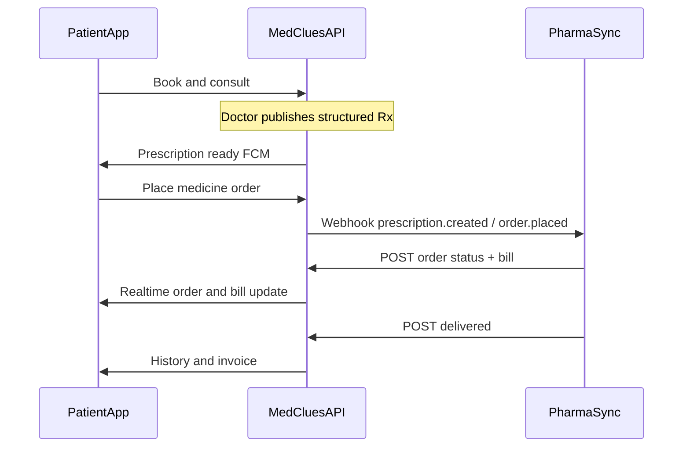

# MEDCLUES ↔ PharmaSync Integration Platform

**Architecture & Implementation Guide**

Transform MEDCLUES into a complete Digital Healthcare Ecosystem where external systems (starting with **PharmaSync**) integrate securely using MEDCLUES APIs.

MEDCLUES remains the **central healthcare platform** — source of truth for patients, appointments, consultations, prescriptions, health records, auth, and clinical workflows.

**PharmaSync** is an independent Pharmacy ERP that consumes MEDCLUES APIs to receive prescriptions and run pharmacy operations.

> **Rule:** No application may access another application’s database. All communication uses secure REST APIs, WebSockets, and signed webhooks.

Related docs:

- [PHARMASYNC_README.md](./PHARMASYNC_README.md) — short team handoff (contract, who builds what, post-build steps)
- [PARTNER_DOMAIN_TEMPLATES.md](./PARTNER_DOMAIN_TEMPLATES.md) — Phase 3 future partner domains (lab, radiology, insurance, …)
- [EMERGENCY_PARTNER_PLATFORM.md](./EMERGENCY_PARTNER_PLATFORM.md) — first partner vertical (reuse the same platform layer)
- [README.md](./README.md) — main product setup and portal credentials

---

## Table of Contents

1. [Integration Principle](#integration-principle)
2. [Overall Architecture](#overall-architecture)
3. [Responsibilities](#responsibilities)
4. [Current Baseline (What Exists Today)](#current-baseline-what-exists-today)
5. [Enterprise Integrations Module](#enterprise-integrations-module)
6. [Role Capabilities](#role-capabilities)
7. [Prescription & Order Flow](#prescription--order-flow)
8. [Patient App — Pharmacy Section](#patient-app--pharmacy-section)
9. [Database Design](#database-design)
10. [API Design](#api-design)
11. [Webhooks](#webhooks)
12. [Security](#security)
13. [Monitoring & Analytics](#monitoring--analytics)
14. [Implementation Phases](#implementation-phases)
15. [Key Files to Add / Change](#key-files-to-add--change)
16. [Future Partners](#future-partners)
17. [Out of Scope (Phase 1)](#out-of-scope-phase-1)

---

## Integration Principle

| Keep unchanged | Add / extend |
|----------------|--------------|
| Patient, doctor, dean, reception, admin appointment flows | Enterprise Integrations console (generalized Partner Hub) |
| Existing JWT roles | Partner type `PHARMACY` + pharmacy scopes |
| Emergency partner APIs (`/api/partner/emergency/*`) | Versioned pharmacy APIs (`/api/v1/partner/pharmacy/*`) |
| Free-text `consultations.prescription` (backward compatible) | Structured `prescription_items` |
| FCM prescription notifications | Pharmacy order Socket.IO + FCM |
| Partner tables from migration `025` | `pharmacies`, `pharmacy_orders`, `pharmacy_order_items` |

**Architectural rule (fixed):**

- MEDCLUES owns clinical data + order orchestration.
- PharmaSync owns inventory, pharmacist ops, and pharmacy billing workflows.
- Sync only via REST + signed webhooks — never shared DB access.

---

## Overall Architecture

```
Patient Mobile App
        │
        ▼
 MEDCLUES Backend (source of truth)
        │
 ┌──────┼──────────────────────────┐
 │      │                          │
 ▼      ▼                          ▼
Hospital Panels              Integration Layer
(Admin / Dean /              API keys · HMAC · scopes
 Doctor / Reception)         Webhooks · Rate limits
                                      │
                    ┌─────────────────┼─────────────────┐
                    ▼                 ▼                 ▼
               PharmaSync      Laboratory ERP    Emergency ERP
              (Pharmacy)         (future)         (exists)
```

---

## Responsibilities

### MEDCLUES owns

- Patient registration & identity
- Hospital / doctor / reception workflows
- Appointments, queue, consultation
- **Prescription generation** (structured + notes)
- Medical records, payments (platform), notifications
- **API gateway / partner registry**
- Audit logs, authentication, authorization
- Pharmacy **order orchestration** (status visible to patient)

### PharmaSync owns

- Pharmacist inbox & verification
- Stock / inventory
- Pharmacy bill generation
- Fulfillment (pickup / delivery ops)
- Returning status & bill metadata to MEDCLUES

---

## Current Baseline (What Exists Today)

Reusable **Emergency Partner Platform** already in the repo:

| Layer | Location |
|-------|----------|
| Schema | `fastapi_back/migrations/025_partner_emergency.sql` |
| Auth | `fastapi_back/app/middleware/partner_auth.py`, `partner_auth_service.py` |
| Webhooks | `partner_webhook_service.py`, `webhook_retry_worker.py` |
| Admin UI | `admin/src/pages/Admin/ManagePartners.jsx` (Partner Hub) |
| Docs | `EMERGENCY_PARTNER_PLATFORM.md` |

**Gaps for pharmacy:**

- Prescriptions are free-text on `consultations` (no reliable line items)
- No `pharmacies` / hospital mapping
- Flutter Pharmacy tile is “coming soon”
- HMAC verification, `allowed_apis` enforcement, and `partner_api_logs` writes are incomplete
- Partner Hub has no `PHARMACY` type

---

## Enterprise Integrations Module

Expand Partner Hub into a Super Admin module: **Enterprise Integrations**.

Capabilities:

| Area | Features |
|------|----------|
| Partners | Register, approve, suspend, soft-delete |
| Credentials | API keys, rotate/revoke, sandbox vs production |
| Access | Rate limits, IP allowlists, `allowed_apis` scopes |
| Webhooks | URL, event subscriptions, retry queue, failed deliveries |
| Observability | Incoming/outgoing request logs, usage analytics, health |
| Environments | Sandbox and production keys per partner |

This console is the single control plane for PharmaSync today and Lab / Insurance / etc. later.

---

## Role Capabilities

### Super Admin

- Register external applications (e.g. PharmaSync)
- Approve / enable / disable / suspend integrations
- Generate & rotate API credentials
- Configure rate limits, webhook URLs, IP allowlists
- View API analytics, failed requests, retry webhooks
- Manage partner permissions (`allowed_apis`)
- **Never** required for day-to-day hospital pharmacy ops

### Hospital Admin (Dean)

- Connected pharmacies for **their hospital only**
- Pharmacy mapping, priority, pickup/delivery flags
- Emergency / 24×7 pharmacy designation
- Operating hours
- **Must not** manage API credentials (Super Admin only)

### Doctor

- Create structured prescription lines during consultation
- Publish / complete → triggers pharmacy webhooks when mapped

### Patient

- View prescriptions, place medicine orders, track status, bills, history

---

## Prescription & Order Flow

### Happy path

```
Doctor creates structured Rx in MEDCLUES
        │
        ▼
Stored in MEDCLUES (source of truth)
        │
        ├──► Patient app: My Prescriptions (+ FCM)
        │
        ▼
Patient taps “Order Medicines”
        │
        ▼
MEDCLUES creates pharmacy_order
        │
        ▼
Webhook → PharmaSync (prescription / order.placed)
        │
        ▼
Pharmacist verifies stock → bill
        │
        ▼
PharmaSync POSTs bill + status → MEDCLUES
        │
        ▼
Patient pays / confirms → Ready / Out for delivery → Delivered
        │
        ▼
MEDCLUES pharmacy history updated (Rx + invoice + status)
```

### Real-time example (14 steps)

1. Patient books appointment in MEDCLUES app.  
2. Reception checks in → doctor queue.  
3. Doctor completes consult → **structured digital prescription**.  
4. Prescription appears under My Prescriptions.  
5. Patient taps **Order Medicines**.  
6. MEDCLUES resolves hospital-mapped pharmacy (PharmaSync) and sends Integration API / webhook.  
7. PharmaSync shows Rx in pharmacist inbox.  
8. Pharmacist verifies stock, reserves, generates bill.  
9. PharmaSync returns bill + status via secure APIs.  
10. Patient app updates (bill, payment, ETA).  
11. After payment, pharmacist marks Ready / Out for Delivery.  
12. PharmaSync notifies MEDCLUES → live tracking in app.  
13. On collection/delivery, PharmaSync sends **Delivered**.  
14. MEDCLUES stores complete pharmacy history; PharmaSync keeps owning pharmacy ops only.

---

## Patient App — Pharmacy Section

Replace the dashboard “Pharmacy coming soon” stub with a real module:

| Capability | Notes |
|------------|--------|
| Active prescriptions | From completed consultations |
| Prescription history | Read-only clinical view |
| Order medicines | Only patient’s own Rx lines — never full pharmacy inventory |
| Pickup vs home delivery | Based on hospital pharmacy settings |
| Track order status | Socket.IO + FCM |
| Bills / invoices | View + download when available |
| Payment history | Platform or synced pharmacy payment status |
| Refills | Phase 2 |
| Contact pharmacy | Phase 2 |

---

## Database Design

### Reuse (platform)

- `partners`, `partner_api_keys`, `partner_webhooks`, `webhook_deliveries`, `partner_api_logs`

### New (suggested migration `031_enterprise_pharmacy.sql`)

#### `prescription_items`

| Column | Purpose |
|--------|---------|
| `id`, `consultation_id` | Link to consultation |
| `name`, `dosage`, `frequency`, `duration` | Clinical line |
| `quantity`, `instructions` | Dispense guidance |
| `sku` / `rxnorm` | Optional later mapping |

Keep free-text `consultations.prescription` as notes for backward compatibility.

#### `pharmacies`

| Column | Purpose |
|--------|---------|
| `hospital_id`, `partner_id` | Hospital ↔ PharmaSync partner |
| `name`, `pharmacy_type` | `main` / `emergency` / `24x7` |
| `supports_pickup`, `supports_delivery` | Fulfillment flags |
| `hours` (JSONB), `priority`, `is_active` | Ops config |

#### `pharmacy_orders`

| Column | Purpose |
|--------|---------|
| `patient_id`, `hospital_id`, `pharmacy_id` | Parties |
| `consultation_id` | Source Rx |
| `status` | See state machine below |
| `fulfillment` | `pickup` / `delivery` |
| `amount_*`, `invoice_url` | Billing snapshot |
| `partner_order_ref` | Idempotent partner reference |

#### `pharmacy_order_items`

Mirrors Rx lines plus pharmacy-confirmed quantity and unit price.

### Order status machine

```
placed
  → accepted | stock_unavailable
  → billed
  → paid
  → ready | out_for_delivery
  → delivered | cancelled
```

---

## API Design

### Patient APIs (JWT `token`)

Prefix: `/api/user/pharmacy`

| Method | Path | Purpose |
|--------|------|---------|
| GET | `/prescriptions` | Active Rx eligible to order |
| POST | `/orders` | Place order (pharmacy + fulfillment) |
| GET | `/orders` | List orders |
| GET | `/orders/{id}` | Detail, bill, status |
| POST | `/orders/{id}/cancel` | Cancel while allowed |

### Partner APIs (API key + HMAC + scopes)

Prefix: `/api/v1/partner/pharmacy`

| Method | Path | Purpose |
|--------|------|---------|
| GET | `/prescriptions/{id}` | Fetch Rx (scoped to partner’s hospitals) |
| GET | `/orders` | List orders for partner |
| GET | `/orders/{id}` | Order detail |
| POST | `/orders/{id}/status` | accepted, stock_unavailable, billed, ready, out_for_delivery, delivered |
| POST | `/orders/{id}/bill` | Line prices + invoice metadata |

Idempotency: require `partner_request_id` (or equivalent) on mutating calls.

### Super Admin

Existing `/api/admin/partners/*` — harden auth, add pharmacy type, scopes, analytics.

### Dean

New hospital-scoped pharmacy mapping endpoints (no key management).

---

## Webhooks

### MEDCLUES → PharmaSync (outbound)

| Event | When |
|-------|------|
| `prescription.created` | Doctor publishes / completes Rx |
| `prescription.updated` | Rx amended |
| `order.placed` | Patient places medicine order |
| `order.cancelled` | Patient/system cancels |
| `payment.completed` | Payment confirmed on MEDCLUES side |

Headers (same pattern as emergency):

- `X-MedClues-Event`
- `X-MedClues-Signature` (`sha256=…`)
- `X-MedClues-Timestamp`

Deliveries logged in `webhook_deliveries` with retry worker backoff.

### PharmaSync → MEDCLUES (inbound)

Status and bill updates via Partner APIs above (not raw DB pushes).

---

## Security

| Control | Implementation |
|---------|----------------|
| Transport | HTTPS only |
| Auth | API keys (`pk_` / `sk_`), hashed secrets, rotation |
| Integrity | Request HMAC (`X-Timestamp`, `X-Signature`); webhook HMAC |
| Access | `allowed_apis` scopes, IP allowlist, RPM rate limits |
| Tenancy | Partner may only see hospitals/pharmacies they are mapped to |
| Audit | Credential changes + API logs (hash bodies; minimize PHI in plaintext logs) |
| Versioning | `/api/v1/partner/...` |

**Auth strategy (Phase 0–1):** API Key + HMAC (+ optional short-lived partner JWT).  
**Later:** OAuth2 client-credentials as an alternate credential type on the same `partners` row — no separate gateway rewrite.

---

## Monitoring & Analytics

Super Admin dashboards should show:

- Active integrations & connected pharmacies
- API usage, success/failure rates, latency
- Webhook delivery status & retries
- Prescriptions synced / orders synced
- Billing sync health

Reuse and generalize `PartnerDashboard.jsx` patterns.

---

## Implementation Phases

### Phase 0 — Harden Enterprise Integrations (platform)

1. Fix partner admin auth (`auth_admin`).
2. Enforce HMAC; remove hardcoded webhook signing secrets.
3. Write `partner_api_logs`; enforce `allowed_apis` / domains.
4. Add partner type `PHARMACY` (+ metadata schema).
5. Expand Super Admin Integrations UI (sandbox/production, IP allowlist, rate limits, webhooks, rotate keys, suspend, retry).
6. Introduce `/api/v1/partner/...` without breaking legacy emergency routes.

### Phase 1 — MVP Pharmacy (PharmaSync path)

**Goal:** consult → structured Rx → order medicines → bill/status → patient updates.

1. **Structured Rx** — `prescription_items`; doctor UI + Flutter detail; webhooks on publish.
2. **Hospital ↔ pharmacy mapping** — `pharmacies` table; Dean UI (no API keys).
3. **Orders domain** — `pharmacy_orders` / items; patient + partner APIs; realtime.
4. **Flutter Pharmacy tab** — active Rx, orders, history, track, bill.

### Phase 2 — Operations depth

- Refills, invoice PDF, payment history
- Availability / estimated pricing probe (no full inventory to patients)
- Failed sync tooling; sandbox vs production enforcement

### Phase 3 — Future partners

Same platform: new `partner_type` + `/api/v1/partner/{domain}/*` templates — Lab, Radiology, Insurance, Corporate health, Wearables, Telemedicine, Home healthcare.

See [PARTNER_DOMAIN_TEMPLATES.md](./PARTNER_DOMAIN_TEMPLATES.md). Live domains remain Pharmacy + Emergency; others expose `/health` + `/capabilities` until a full MVP is built.

---

## Key Files to Add / Change

| Area | Files |
|------|--------|
| Migration | `fastapi_back/migrations/031_enterprise_pharmacy.sql` |
| Platform harden | `partner_auth.py`, `partner_admin_routes.py`, webhook signing |
| Pharmacy API | New `partner_pharmacy_routes.py`, `pharmacy_order_model.py`, `pharmacy_service.py` |
| Rx publish hook | `lifecycle_controller.py` → webhook enqueue |
| Super Admin | Expand `ManagePartners.jsx` → Enterprise Integrations |
| Dean | Pharmacy mapping under hospital settings |
| Flutter | Pharmacy screens + services; wire dashboard quick action |

---

## Future Partners

The same Integration Platform should later support:

- Laboratory systems  
- Ambulance / emergency (already started)  
- Insurance providers  
- Corporate health platforms  
- Diagnostic / radiology centers  
- Government health portals  
- Home healthcare & wearables  
- Additional telemedicine platforms  

**No architectural rewrite** — only new partner registrations, scopes, and domain route modules.

---

## Out of Scope (Phase 1)

- Full OAuth2 authorization-code flows for partners  
- PharmaSync ERP internals (they only consume MEDCLUES APIs)  
- Direct database sharing between products  
- Lab / insurance partner modules (Phase 3 templates only)

---

## Sequence Diagram



---

## Status

| Item | Status |
|------|--------|
| Emergency partner platform (reuse) | Exists |
| Enterprise Integrations hardening | Done (Phase 0) |
| PharmaSync pharmacy domain | Done (Phase 1 MVP) |
| Flutter Pharmacy module | Done (Phase 1–2) |
| Phase 2 (refills, invoice PDF, pay, probe, sandbox, sync tooling) | Done |
| Phase 3 partner domain templates | Done (`PARTNER_DOMAIN_TEMPLATES.md`) |

This document is the master implementation guide for MEDCLUES ↔ PharmaSync. Implement phases in order; keep MEDCLUES as the clinical source of truth at every step.
