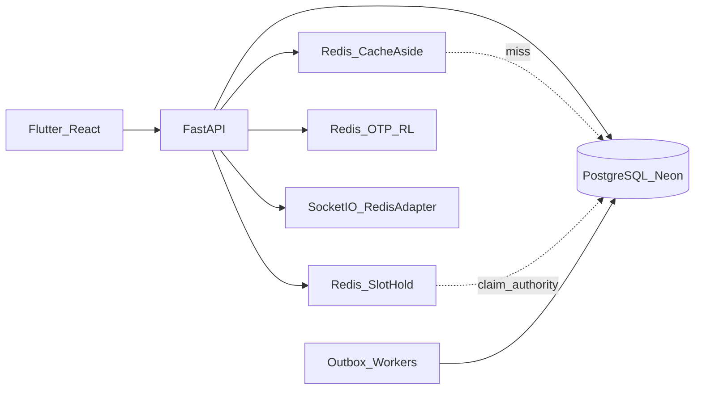

# MedClues Redis Integration & Performance Report

**Date:** 2026-07-20  
**Principle:** PostgreSQL is the **source of truth**. Redis is an **in-memory optimization layer** (cache, locks, ephemeral auth, rate limits, Socket.IO fan-out).  
**Enable:** `REDIS_URL=redis://localhost:6379/0` (`docker compose up -d redis`)

Related: [DR_SLO_RUNBOOK.md](./DR_SLO_RUNBOOK.md) · [MICROSERVICE_BOUNDARIES.md](./MICROSERVICE_BOUNDARIES.md) · [ENTERPRISE_SCALABILITY_AUDIT_2026-07-20.md](./ENTERPRISE_SCALABILITY_AUDIT_2026-07-20.md)

---

## 1. Architecture



| Layer | Role |
|-------|------|
| PostgreSQL | Appointments, EMR, payments, inventory authority, refresh tokens, notification outbox |
| Redis String/JSON | Directory caches, dashboards, search suggestions, OTP payloads |
| Redis Sorted Set | HTTP + partner rate limits |
| Redis SET NX | Temporary slot holds |
| Redis Pub/Sub | Socket.IO multi-instance |
| Redis key + TTL | Access-token blacklist on logout |

---

## 2. Hot-read catalog (cache targets)

| API / module | Est. before | Est. cache hit | TTL | Invalidation | Impact | Priority |
|--------------|-------------|----------------|-----|--------------|--------|----------|
| `GET /api/specialty/*` list | 40–120 ms | 2–8 ms | 24h | Specialty CRUD | High | P0 |
| `GET /api/doctor/list` | 80–400 ms | 3–15 ms | 10m | Doctor create/update/availability | High | P0 |
| `GET /api/doctor/profile` | 30–80 ms | 2–8 ms | 1h | Profile update | High | P0 |
| `GET /api/hospital-tieup` list | 150–800 ms | 5–20 ms | 10m | Hospital CRUD | High | P0 |
| `GET /api/admin/system-settings` | 20–60 ms | 2–5 ms | 24h | Settings update | Medium | P0 |
| `GET /api/admin/dashboard` | 500–3000 ms | 5–30 ms | 5m | Prefix `dashboard:` / doctor-hospital writes | Very high | P0 |
| `GET /api/doctor/dashboard` | 100–600 ms | 5–25 ms | 5m | Doctor writes / booking | High | P0 |
| Queue status snapshot | 50–200 ms | 2–10 ms | **15s** | Auto TTL (+ Socket.IO) | High | P0 |
| Community categories | 5–20 ms | 1–3 ms | 1h | Rare | Medium | P1 |
| Community popular feed | 40–150 ms | 3–10 ms | 15m | Publish / answer | Medium | P1 |
| Community search suggest | 30–100 ms | 2–8 ms | 30m | Community invalidate | Medium | P1 |
| `/api/search` (no patient) | 40–200 ms | 3–15 ms | 30m | Doctor/hospital/specialty writes | High | P0 |
| Medicine autocomplete | openFDA + mem | Redis-ready pattern | 30m | N/A (external) | Medium | P2 |
| Lab list | 40–120 ms | — (key ready) | 1h | Lab CRUD | Medium | P2 |
| Partner domain catalog | static/PG | key ready | 1h | Partner admin | Low | P2 |

**Never cached:** booked appointments, payment state, inventory/stock, lab results, EMR notes, partner patient payloads, OTP values beyond Redis ephemeral store.

---

## 3. Implementations shipped (this pass)

| Module | Purpose | Structure | TTL | Invalidation | Files |
|--------|---------|-----------|-----|--------------|-------|
| Cache keys + aside | Shared naming / get-set-delete | String JSON | per key | `delete_prefix` | `cache_keys.py`, `cache_service.py` |
| Specialties | Master list | String | 24h | create/update/delete | `specialty_controller.py` |
| Doctors | List + profile | String | 10m / 1h | update/availability | `doctor_controller.py`, `admin_controller.py` |
| Hospitals | List | String | 10m | add/update/delete | `hospital_controller.py` |
| System config | Platform settings | String | 24h | update settings | `admin_controller.py` |
| Dashboards | Admin + doctor widgets | String | 5m | doctor/hospital prefix | controllers above |
| Queue snapshot | Live dashboard | String | 15s | TTL | `queue_service.py` |
| Community | Categories / popular / search | String | 1h / 15m / 30m | admin publish | `community_service.py` |
| Search | Unified suggest | String | 30m | doctor/hospital/specialty | `search_service.py` |
| Slot hold | Checkout race soft-lock | String SET NX | 5m | release / book | `slot_lock_service.py`, `doctor_slot_service.py`, `user_routes` |
| Password-reset OTP | Multi-instance | String JSON | 10m | consume | `password_reset_storage.py` |
| Login OTP | Already Redis | String | 5m | consume | `otp_storage.py` |
| Rate limits | HTTP + partner + booking | ZSET | 60s window | auto | `rate_limit.py`, `partner_auth.py`, `user_routes` |
| Session blacklist | Logout access JWT | String | ~7d | logout | `session_blacklist.py`, `auth_controller.py` |
| Socket.IO | Multi-API fan-out | Pub/Sub | — | — | `socket_service.py` |
| Ops SLO | Hit ratio | — | — | — | `ops_routes.py` |

**Booking authority remains PostgreSQL** (`claim_slot_by_id` / `FOR UPDATE`). Redis hold is an extra UX/concurrency shield.

**Notifications / webhooks** remain **Postgres outbox** (`FOR UPDATE SKIP LOCKED`) — correct for durability; Redis Streams are optional later for fan-out only.

---

## 4. Key naming convention

```
doctor:{id}
doctor:list:{hospital|all}:{limit}:{offset}:{q}
hospital:{id}
hospital:list:{limit}:{offset}:{q}
specialty:list
config:system
community:categories
community:trending:{sort}:{specialty}:{limit}
dashboard:admin | dashboard:doctor:{id} | dashboard:dean:{hid}
queue:{doctorId}:{slotDate}
search:{kind}:{q}
otp:{email} | pwdreset:{role}:{email} | signup_verified:{email}
slot:hold:{slotId}
session:bl:{tokenHash}
rl:{scope}:{ip} | partner_rl:{partnerId}
```

---

## 5. TTL policy (summary)

| Data | TTL |
|------|-----|
| Doctor profile | 1 hour |
| Doctor / hospital lists | 10 minutes |
| Hospital profile (when added) | 12 hours |
| Departments / specialties / config | 24 hours |
| Trending community | 15 minutes |
| Dashboard | 5 minutes |
| Queue snapshot | 15 seconds |
| Search suggestions | 30 minutes |
| OTP / slot hold | 5 minutes |
| Password reset | 10 minutes |
| Session blacklist | Login / refresh lifetime |

Invalidation is **write-through delete**, not TTL-only.

---

## 6. Redis data structures — why

| Structure | Use |
|-----------|-----|
| **String (JSON)** | Cache-aside payloads; OTP blobs; slot holder id |
| **Sorted set** | Sliding-window rate limits |
| **Pub/Sub** | Socket.IO adapter across API replicas |
| **SET NX + EX** | Slot hold (mutex with auto-expiry) |
| **Hash** (future) | Doctor field-level cache if payloads grow |
| **Streams** (future) | Notification fan-out if outbox volume forces it |
| **Lists** | Avoid for queues that need durability — keep PG outbox |

---

## 7. Appointment & queue design decisions

| Concern | Decision |
|---------|----------|
| Booked appointments | **Not cached** |
| Slot correctness | **Postgres claim** |
| Soft hold during checkout | Redis `slot:hold:{id}` + `POST /api/user/slots/{id}/hold` |
| Queue tokens | Postgres advisory lock (unchanged) |
| Queue UI | 15s Redis snapshot + Socket.IO |

---

## 8. Auth & OTP

| Item | Store |
|------|-------|
| Access JWT | Stateless (+ optional Redis blacklist on logout) |
| Refresh tokens | **PostgreSQL** (reuse detection / revoke-all) |
| Login OTP | Redis `otp:*` (fallback memory) |
| Password-reset OTP | Redis `pwdreset:*` (fallback memory) |
| Signup verified marker | Redis `signup_verified:*` |

---

## 9. Rate limiting (Redis ZSET)

| Scope | Typical limit |
|-------|----------------|
| Login | 30 / hour / IP |
| OTP send/verify | existing `otp_*` scopes |
| Book appointment | **20 / minute** (new) |
| Partner APIs | partner `rate_limit_rpm` |
| Emergency | existing |

---

## 10. What Redis intentionally does **not** replace

- Notification / webhook durable delivery → Postgres outbox  
- Refresh-token audit trail → Postgres  
- Inventory, bills, lab results, EMR → Postgres / partners  
- Celery/ARQ job broker → not required yet; workers already separate process  

---

## 11. Performance estimates (directional)

Assumes `REDIS_URL` set, co-located Redis, warm cache, mid-scale catalog.

| Metric | Without Redis | With Redis (warm) | Est. change |
|--------|---------------|-------------------|-------------|
| Specialty / config p95 | 50–120 ms | 3–10 ms | **~80–90%↓** |
| Doctor/hospital list p95 | 100–500 ms | 5–25 ms | **~70–90%↓** |
| Admin dashboard p95 | 0.5–3 s | 10–40 ms (hit) | **~90%↓** on repeat |
| PG QPS from directory reads | Baseline | **~40–70%↓** | High |
| Neon connections under browse load | High | Lower | Medium–High |
| Booking correctness | PG locks | PG + Redis hold | Safer under storm |
| Multi-instance OTP/RL/WS | Broken / sticky | Shared | Required for HA |

*Measure with `fastapi_back/scripts/load/` + `/api/ops/slo` cache hit ratio after enabling Redis.*

---

## 12. Database protection

Queries Redis removes on hit:

- Specialty full table scan/list  
- Doctor list/profile selects  
- Hospital list + doctor-count fan-in  
- Admin dashboard multi-aggregate bundle (15+ queries)  
- Doctor dashboard appointment scans (5 min)  
- Repeated search suggestion ILIKE/FTS  
- Queue status polling storms (15s coalescing)

---

## 13. High availability (ops)

| Mode | Recommendation |
|------|----------------|
| Dev | `docker compose` Redis 7 AOF |
| Staging | Managed Redis (single + daily backup) |
| Production | Redis Sentinel or provider HA (Upstash / ElastiCache / Memorystore) |
| Persistence | AOF every sec **or** provider snapshots — cache can rebuild; **do not** rely on Redis for money/clinical truth |
| Failover | App already **falls back** to Postgres / memory when Redis down |
| Memory | `maxmemory-policy allkeys-lru`; size for cache + OTP + RL |

---

## 14. Monitoring

| Signal | Where |
|--------|-------|
| Redis ping | `/health/deep`, `/api/ops/slo` |
| Cache hit/miss | `/api/ops/slo` → `checks.cache` |
| Prometheus | existing `/metrics` + [prometheus/slo_rules.yml](./prometheus/slo_rules.yml) |
| Redis Insight | Point at `REDIS_URL` |
| Alerts | Redis down, hit ratio &lt; 0.5 under load, evictions spike |

---

## 15. Implementation priority board

| P0 (done / enable now) | P1 | P2 |
|------------------------|----|----|
| Set `REDIS_URL` in prod | Dean/reception dashboard cache | Lab list / partner catalog cache |
| Directory + specialty + config | Medicine suggest → Redis | Redis Streams for notify fan-out |
| Admin/doctor dashboard | Token blacklist check in auth middleware | Sentinel/cluster runbook drill |
| Slot hold + booking RL | Geo master tables if added | OpenSearch + Redis together |
| OTP + password-reset + RL + Socket.IO | — | — |

---

## 16. How to run

```bash
docker compose up -d redis
# fastapi_back/.env
REDIS_URL=redis://localhost:6379/0
```

Restart API. Confirm:

- `/health/deep` → redis `ok`  
- `/api/ops/slo` → `checks.cache`  
- Specialty/doctor list twice → second call faster; hit_ratio rises  

Client optional: `POST /api/user/slots/{slotId}/hold` before payment UI.

---

## 17. Code map

| Path | Role |
|------|------|
| `fastapi_back/app/services/redis_client.py` | Async client |
| `fastapi_back/app/services/cache_keys.py` | Names + TTLs |
| `fastapi_back/app/services/cache_service.py` | Cache-aside + invalidation |
| `fastapi_back/app/services/slot_lock_service.py` | Slot SET NX |
| `fastapi_back/app/services/session_blacklist.py` | Logout blacklist |
| `fastapi_back/app/utils/otp_storage.py` | Login OTP |
| `fastapi_back/app/utils/password_reset_storage.py` | Reset OTP |
| `fastapi_back/app/middleware/rate_limit.py` | HTTP RL |
| `fastapi_back/app/middleware/partner_auth.py` | Partner RL (shared sync client) |
| `fastapi_back/app/services/socket_service.py` | Redis adapter |
| `docker-compose.yml` | Local Redis 7 |

---

## 18. Certification note

Redis integration **materially improves** browse/dashboard/search/OTP/HA readiness.  
**Million-user certification** still requires: provisioned Redis HA, worker fleet, measured k6 tiers, and Neon connection budgeting — not Redis alone.
