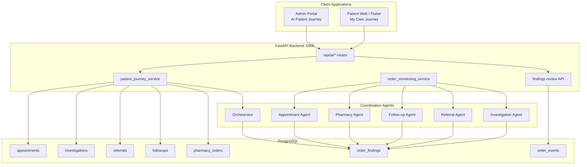
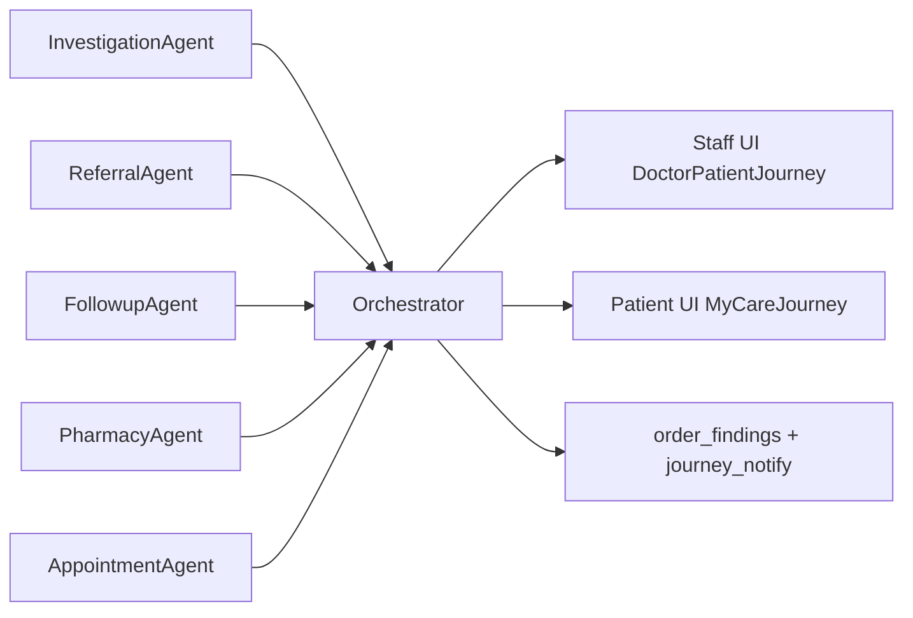
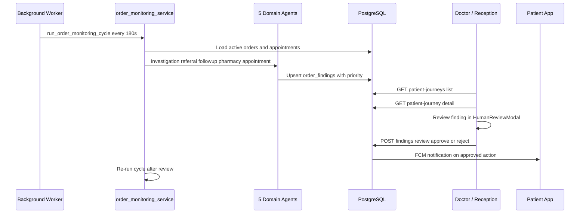
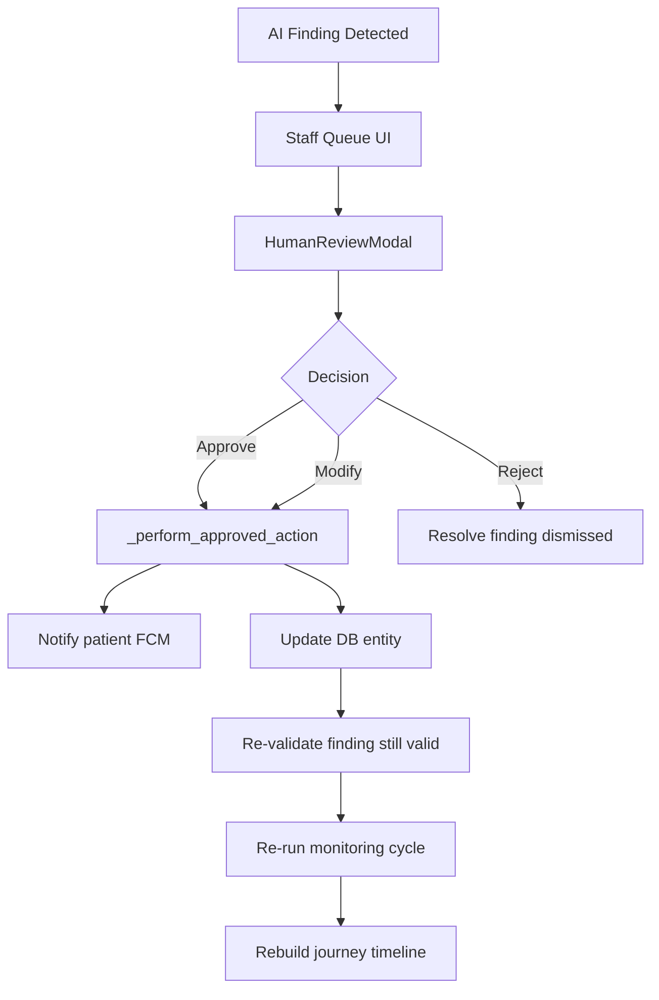

# AI Healthcare Patient Journey & Follow-Up Coordination Agent

**PPT slide content · Problem Statement #12**  
**Implementation prototype:** MEDCLUES Healthcare Platform  
**Domain:** Healthcare / Patient Coordination / Multi-Agent AI

---

## Slide 1 — Title

**Title:** AI Healthcare Patient Journey & Follow-Up Coordination Agent  
**Subtitle:** Multi-Agent Care Coordination with Human-in-the-Loop Review  
**Implementation:** MEDCLUES Healthcare Platform  
**Domain:** Healthcare / Patient Coordination / Multi-Agent AI  
**Tagline:** *From fragmented hospital steps to one coordinated patient journey*

---

## Slide 2 — Problem Statement

**Headline:** Fragmented care coordination causes delays and missed follow-ups

**Points to cover:**
- Patients move across **registration → consultation → diagnostics → pharmacy → specialist referral → follow-up** — often handled by different staff and systems
- Administrative status is scattered; no single view of “where is my care right now?”
- **Missed actions** happen silently: lab report uploaded but not reviewed, referral created but specialist not booked, follow-up date passed
- Staff spend time chasing status instead of acting on clear, prioritized coordination tasks
- Clinical decisions must **never** be automated — only **authorized administrative coordination** should be assisted

**One-liner:**  
*Healthcare data exists, but coordination gaps between services create delays, confusion, and overdue follow-ups.*

---

## Slide 3 — Objective

**Primary objective:**  
Develop a healthcare coordination agent that manages **authorized administrative and care-coordination information** across appointments, referrals, investigations, and follow-ups — with **mandatory human review** before clinically significant actions.

| Goal | How MEDCLUES addresses it |
|------|---------------------------|
| Unified patient journey | 11-step timeline (patient + staff views) |
| Detect missing actions | 5 rule-based monitoring agents + `order_findings` |
| Multi-service coordination | Investigation, Referral, Follow-up, Pharmacy, Appointment agents + Orchestrator |
| Safe AI usage | Deterministic state from DB; LLM only rephrases grounded staff summaries |
| Human authority | Approve / Reject / Modify via `HumanReviewModal` on all staff queues |

---

## Slide 4 — Expected Prototype Features

| Feature | Status in MEDCLUES |
|---------|-------------------|
| Appointment coordination | Yes — lifecycle tracking, missed-slot detection, doctor accept/reject |
| Referral tracking | Yes — specialist assignment, accept, patient booking |
| Investigation & follow-up monitoring | Yes — lab pipeline + overdue follow-up agents |
| Patient journey timeline | Yes — My Care Journey (patient) + AI Patient Journey (staff) |
| Missing-action & overdue detection | Yes — `order_monitoring_service` every ~180s |
| Multi-agent coordination | Yes — 5 agents + orchestrator |
| Grounded summaries for staff | Yes — facts JSON → optional LLM; template fallback |
| Human review before actions | Yes — `POST /api/ai/findings/{id}/review` |

---

## Slide 5 — Proposed Solution

**Headline:** A coordination layer on top of existing hospital data — not a replacement EMR

**Three-layer model:**

1. **Data layer** — PostgreSQL: appointments, investigations, referrals, follow-ups, pharmacy orders, notifications
2. **Agent layer** — Rule-based monitors scan for workflow gaps → write prioritized findings to `order_findings`
3. **Experience layer** — Patient timeline + staff dashboard + human review modal + FCM/patient notifications

**Core principle:**  
*Agents detect and recommend; authorized staff decide.*

**Key backend files:**
- `fastapi_back/app/services/patient_journey_service.py`
- `fastapi_back/app/services/order_monitoring_service.py`

---

## Slide 6 — Innovation / Uniqueness

1. **Episode-scoped patient journey** — Each new booking starts a fresh care timeline; past visits move to history
2. **Deterministic-first AI** — Journey status, findings, and agent activity computed from live DB; LLM never diagnoses or invents data
3. **Unified human review** — One review API powers Doctor Dashboard, AI Patient Journey, Referrals/Lab/Pharmacy/Follow-up queues
4. **Referral-aware specialist view** — Specialists see referred patients in AI Patient Journey even before a direct appointment exists
5. **Grounded orchestration** — Orchestrator aggregates agent outputs into one pipeline view + optional LLM summary constrained to supplied facts
6. **Not autonomous clinical AI** — Explicitly coordination-only; disclaimers in UI

**Differentiator:**  
*Multi-agent hospital coordination with human-in-the-loop governance and episode-fresh patient journeys.*

---

## Slide 7 — Methodology / Approach

| Phase | Activity |
|-------|----------|
| **Phase 1** | Requirements & data mapping — appointment lifecycle, investigation statuses, referral states, follow-up due dates, pharmacy stages |
| **Phase 2** | Agent design (rule-based) — finding types e.g. `REPORT_REVIEW_PENDING`, `REFERRAL_APPOINTMENT_PENDING`, `FOLLOWUP_OVERDUE` |
| **Phase 3** | Orchestrator & journey builder — 11 steps → journey status (`ON_TRACK` / `UPCOMING` / `ATTENTION_REQUIRED` / `OVERDUE`) |
| **Phase 4** | Human review workflow — approve/reject/modify → coordination actions (notify, confirm, mark reviewed, book specialist) |
| **Phase 5** | Dual UI — patient timeline + staff findings/agent activity/review modal |
| **Phase 6** | Validation — `fastapi_back/tests/test_patient_journey.py` + live demo path |

---

## Slide 8 — Key Features

### For patients (My Care Journey)
- Active visit timeline with step-by-step status
- Specialist referral cards with in-app slot booking
- Lab report view/download
- Past My Journey history panel

### For staff (AI Patient Journey)
- Patient list: bookings + specialist referrals
- 11-step pipeline with color-coded status
- AI Agent Activity panel (6 agents)
- AI Findings with Approve / Reject / Modify
- Re-check agents button
- Create referral, schedule follow-up

### Background automation
- Monitoring cycle every ~180 seconds
- Stale finding auto-close when DB state resolves gap
- Cache + parallel DB reads for performance

---

## Slide 9 — Technology Stack

| Layer | Technologies |
|-------|-------------|
| Backend API | FastAPI, Uvicorn, Python 3.x, asyncpg |
| Database | PostgreSQL (Neon / local), SQL migrations |
| Auth | JWT (python-jose), role-based access |
| Cache | Redis + in-process fallback |
| Patient web | React 18, Vite 7, Tailwind, Axios |
| Staff admin | React 18, Vite 5, Tailwind, Chart.js, Socket.IO |
| Mobile (prod) | Flutter, Riverpod, Dio |
| AI (optional) | Mistral / Gemini / OpenAI — summaries only |
| Notifications | FCM push, Brevo email, in-app notifications |
| Payments / video | Razorpay, Agora RTC |

**Architecture style:** Modular monolith — one API, one DB, multiple clients

---

## Slide 10 — System Architecture

**Agent → Orchestrator → UI (simplified):**

---

## Slide 11 — Patient Journey Pipeline (11 Steps)

**Episode rule (patient view):** Only **active appointment** data on main timeline; older visits in **Past My Journey**.

**Journey status labels:** ON TRACK · UPCOMING · ATTENTION REQUIRED · OVERDUE

---

## Slide 12 — Multi-Agent Monitoring Cycle

---

## Slide 13 — Human-in-the-Loop Review

**Examples of approved actions:** Mark report reviewed, confirm appointment, book specialist slot, send follow-up reminder.

**Review surfaces (same API everywhere):**

| UI | Route |
|----|-------|
| AI Patient Journey | `/doctor-patient-journey` |
| Doctor dashboard | `/doctor-dashboard` |
| Referrals queue | `/reception-referrals` |
| Follow-up queue | `/reception-followup-queue` |
| Pharmacy queue | `/reception-pharmacy-queue` |

**API:** `POST /api/ai/findings/{id}/review`

---

## Slide 14 — Implementation / Prototype

| Component | Path / Route |
|-----------|--------------|
| Patient journey UI | `frontend/src/pages/MyCareJourney.jsx` — `/my-care-journey` |
| Staff journey UI | `admin/src/pages/Doctor/DoctorPatientJourney.jsx` — `/doctor-patient-journey` |
| Human review modal | `admin/src/components/HumanReviewModal.jsx` |
| Journey API (patient) | `GET /api/ai/my-care-journey` |
| Journey API (staff) | `GET /api/ai/patient-journey/{patient_id}` |
| Refresh + re-check | `POST /api/ai/patient-journey/{patient_id}/refresh` |
| Review API | `POST /api/ai/findings/{finding_id}/review` |

### Live demo script (5 steps)

1. Book consultation → complete visit → order lab test → upload report
2. Doctor opens **AI Patient Journey** → reviews report → creates referral to specialist
3. Specialist accepts referral → patient books slot on **My Care Journey**
4. Open Referrals / Lab / Pharmacy / Follow-up queues → approve/reject AI findings
5. Refresh journey — all five agents + orchestrator reflect current state

### Database migrations

| Migration | Purpose |
|-----------|---------|
| `058_order_routing.sql` | `order_findings`, `order_events` |
| `060_order_findings_review.sql` | Human review columns + evidence JSONB |
| `062_care_journey_columns.sql` | Care journey support columns |
| `066_journey_pharmacy_appointment_entities.sql` | Pharmacy + appointment entity types |

---

## Slide 15 — Results / Expected Impact

### Operational impact (expected)
- Reduced time to identify overdue follow-ups and pending report reviews
- Fewer missed specialist bookings after referral creation
- Single source of truth for patient coordination status

### Qualitative impact
- Patients see clear visit progress instead of calling the hospital
- Doctors/reception get prioritized coordination alerts, not raw data dumps
- Safer AI adoption: human review gate before any coordination action

### Before vs After

| Before | After (MEDCLUES) |
|--------|------------------|
| Status scattered across departments | One 11-step journey timeline |
| Follow-ups missed silently | Follow-up agent flags OVERDUE/MISSED |
| Referral created, never booked | Referral agent + patient booking flow |
| Staff manually checks each system | Agents surface findings with evidence |
| AI might hallucinate clinical advice | LLM limited to grounded coordination summary |

---

## Slide 16 — Future Scope

- **Flutter mobile parity** — Full My Care Journey + push alerts on primary mobile app
- **Episode-linked orders** — `appointment_id` on investigations/referrals for tighter scoping
- **Predictive scheduling** — Suggest follow-up slots based on doctor availability
- **Hospital analytics dashboard** — Coordination SLA metrics (report review time, referral-to-booking conversion)
- **Multi-hospital federation** — Dean-level view of coordination bottlenecks
- **Voice / WhatsApp reminders** — Extend `journey_notify` to additional channels
- **FHIR integration** — Interoperability with external lab/HIS systems

---

## Slide 17 — Closing

**Summary:**  
MEDCLUES delivers a production-style prototype of an **AI Healthcare Patient Journey & Follow-Up Coordination Agent** — multi-agent detection, human-governed actions, and episode-fresh patient timelines.

**Call to action:** Live demo — patient journey + staff review workflow

**Repository:** [github.com/231fa04c77-crypto/AGENTIC-AI](https://github.com/231fa04c77-crypto/AGENTIC-AI)

---

## Appendix A — Coordination Agents & Finding Types

| Agent | Monitors | Example finding types |
|-------|----------|------------------------|
| **Investigation** | Lab orders & report review | `REPORT_REVIEW_PENDING`, `INVESTIGATION_PENDING`, `INVESTIGATION_DELAYED` |
| **Referral** | Specialist routing & booking | `REFERRAL_NO_SPECIALIST`, `REFERRAL_AWAITING_SPECIALIST`, `REFERRAL_APPOINTMENT_PENDING` |
| **Follow-up** | Scheduled / overdue visits | `FOLLOWUP_UPCOMING`, `FOLLOWUP_OVERDUE`, `FOLLOWUP_MISSED` |
| **Pharmacy** | Order acceptance, payment, pickup | `PHARMACY_ORDER_PENDING`, `PHARMACY_PAYMENT_PENDING`, `PHARMACY_READY_NOT_COLLECTED` |
| **Appointment** | Primary consultation lifecycle | `APPOINTMENT_AWAITING_CONFIRMATION`, `APPOINTMENT_MISSED`, `APPOINTMENT_NOT_COMPLETED` |
| **Orchestrator** | Aggregates all agents + journey status | Agent activity panel + optional grounded LLM summary |

Monitoring entry point: `order_monitoring_service.run_order_monitoring_cycle()`

---

## Appendix B — AI Journey API Endpoints

| Method | Endpoint | Auth | Purpose |
|--------|----------|------|---------|
| GET | `/api/ai/patient-journeys` | Staff | List patients needing attention |
| GET | `/api/ai/patient-journey/{patient_id}` | Staff | Full staff journey (findings, agents, summary) |
| POST | `/api/ai/patient-journey/{patient_id}/refresh` | Staff | Re-run monitoring + rebuild journey |
| POST | `/api/ai/findings/{finding_id}/review` | Staff | Human review (approve/reject/modify) |
| GET | `/api/ai/my-care-journey` | Patient | Patient episode timeline |

---

## Appendix C — Security & Governance

- **Role-based access** — Patients see own journey; doctors/reception see assigned hospital patients
- **No clinical automation** — Agents monitor administrative workflow only; no diagnosis or prescription
- **Human review required** — All coordination actions gated through staff approval
- **Audit trail** — `order_events` logs finding reviews and coordination actions
- **Grounded AI** — LLM receives facts JSON only; template fallback when LLM disabled

---

## PPT Design Tips

- Use **one flow diagram per slide** (Slides 10–13); avoid crowding
- Color-code journey steps: green = complete, amber = pending, red = overdue/attention
- Demo slide: split screen — patient phone + doctor admin panel
- Keep **“Human review required”** visible on staff-facing slides as a trust anchor
- Export mermaid diagrams at [mermaid.live](https://mermaid.live) for PowerPoint images

---

*Generated for MEDCLUES · Problem Statement #12 · Hackathon presentation*
