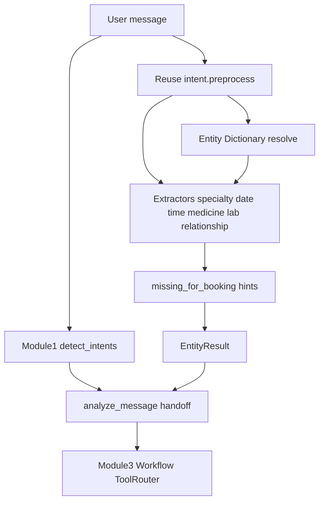

# Module 2 — Entity Extraction

Pure **entity extraction** for the MEDCLUES AI Assistant.

**Does:** pull structured slots from text (specialty, date, time, medicine, lab, relationship, …).  
**Does not:** call APIs, invent doctors/slots, or run workflows.

## Public API

```python
from app.services.ai.entity import extract_entities, analyze_message

ents = extract_entities("Book a dermatologist tomorrow morning for my mother")
print(ents.to_dict())

# Intent + Entities handoff for Module 3+
payload = analyze_message("Book a dermatologist and what is diabetes")
print(payload["handoff"])
```

## Output shape

```json
{
  "entities": {
    "specialty": "Dermatologist",
    "date": "2026-07-24",
    "time_hint": "morning",
    "relationship": "Mother"
  },
  "spans": [{"type": "specialty", "value": "Dermatologist", "confidence": 0.9}],
  "missing_for_booking": [],
  "processing_ms": 0.4,
  "normalized_message": "...",
  "language": "en",
  "error": null
}
```

## Architecture



Entity knowledge lives in [`dictionary/`](dictionary/) (Module 4).  
Synonym normalization runs via [`../synonym/`](../synonym/) (Module 5).  
Abbreviation expansion via [`../abbreviation/`](../abbreviation/) (Module 6).  
Spelling correction via [`../spelling/`](../spelling/) (Module 7).

## Non-goals

- No Tool Router / booking execution  
- No RAG / LLM  
- No replacement of live gateway routing  

Gateway may log `analyze_message` when `AI_INTENT_ENGINE_SHADOW=true` (shadow only).

## Tests

`tests/test_ai_entity_engine.py`  
`tests/test_ai_entity_dictionary.py`
