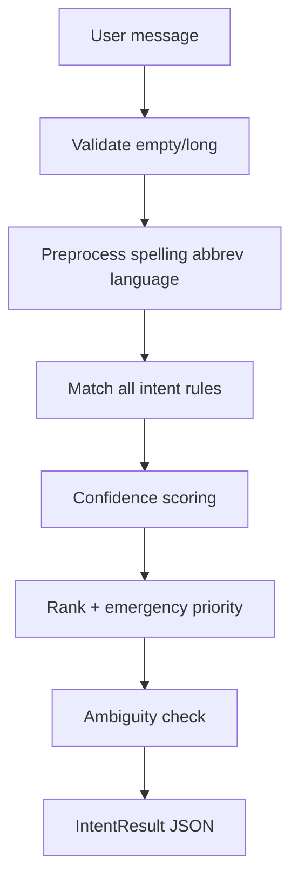
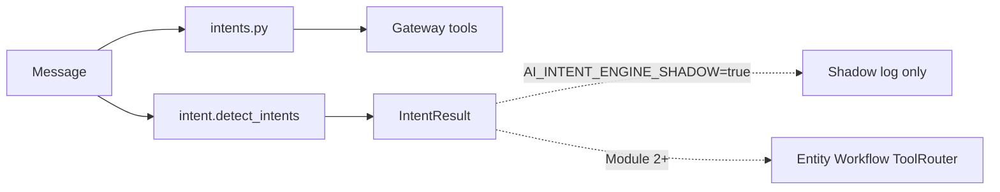
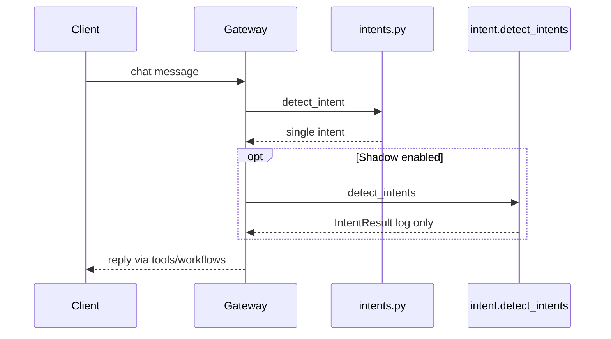

# Module 1 — Intent Engine

Pure **intent detection** for the MEDCLUES AI Assistant.

**Does:** classify what the user wants (multi-intent, confidence, ambiguity, message type).  
**Does not:** call tools, APIs, DB, Redis, or LLMs; does not book/cancel/prescribe.

Live gateway still uses [`../intents.py`](../intents.py). This package is ready for Module 2 and optional shadow logging.

## Public API

```python
from app.services.ai.intent import detect_intents, to_legacy_intent

result = detect_intents("Book a dermatologist and tell me what diabetes is")
print(result.to_dict())
# Optional future cutover:
legacy = to_legacy_intent(result)
```

## Output shape

```json
{
  "primary_intent": "book_appointment",
  "secondary_intents": ["disease_information"],
  "confidence": {
    "book_appointment": 0.92,
    "disease_information": 0.88
  },
  "requires_clarification": false,
  "message_type": "workflow",
  "processing_ms": 0.5,
  "normalized_message": "...",
  "language": "en",
  "error": null
}
```

## Architecture



## Flow (vs live assistant)



## Sequence



## Class / module map

| Module | Responsibility |
|--------|----------------|
| `catalog.py` | Intent IDs, priority, message_type |
| `schemas.py` | `IntentResult`, errors |
| `preprocess.py` | Normalize, typos, abbreviations, language hint |
| `matcher.py` | Multi-rule matching |
| `confidence.py` | Per-hit scores |
| `ranking.py` | Sort + emergency boost |
| `ambiguity.py` | `requires_clarification` |
| `detector.py` | Orchestration + logging |
| `adapter.py` | Map to legacy gateway intents |

## Priority rules

1. Emergency intents always preferred when present.  
2. Then appointment / support / medicine / lab / community / navigation / general.  
3. Ambiguous short phrases (`Book.`, `Doctor.`, `Help`) set `requires_clarification=true`.

## Shadow flag

```env
AI_INTENT_ENGINE_SHADOW=false
```

When `true`, gateway logs Module-1 output next to the legacy intent **without changing replies**.

## Adapter map (examples)

| Module 1 | Legacy (`intents.py`) |
|----------|------------------------|
| `disease_information` | `health_education` |
| `greeting` | `basic_conversation` |
| `view_appointment` | `view_appointments` |
| `medicine_information` | `medicine_info` |
| `explain_reports` | `explain_lab_report` |
| `unknown_intent` | `unknown` |

## Performance

- Deterministic regex/phrase matching only (no LLM).  
- Target &lt;100 ms; stress test expects mean &lt;5 ms for thousands of short messages.

## Extensibility

- **Preferred:** add intents / synonyms / examples in
  [`dictionary/intent_dictionary.yaml`](dictionary/intent_dictionary.yaml)
  (see [`dictionary/README.md`](dictionary/README.md)).  
- Python fallback rules remain in `matcher.py` / `catalog.py` if YAML is missing.  
- Language: `preprocess.detect_language_hint` is a hook for HI/TE rules later.  
- Downstream modules consume `detect_intents()` directly or via `to_legacy_intent()`.

## Tests

- `tests/test_ai_intent_engine.py`  
- `tests/test_ai_intent_engine_stress.py`  
- `tests/test_ai_intent_dictionary.py`
