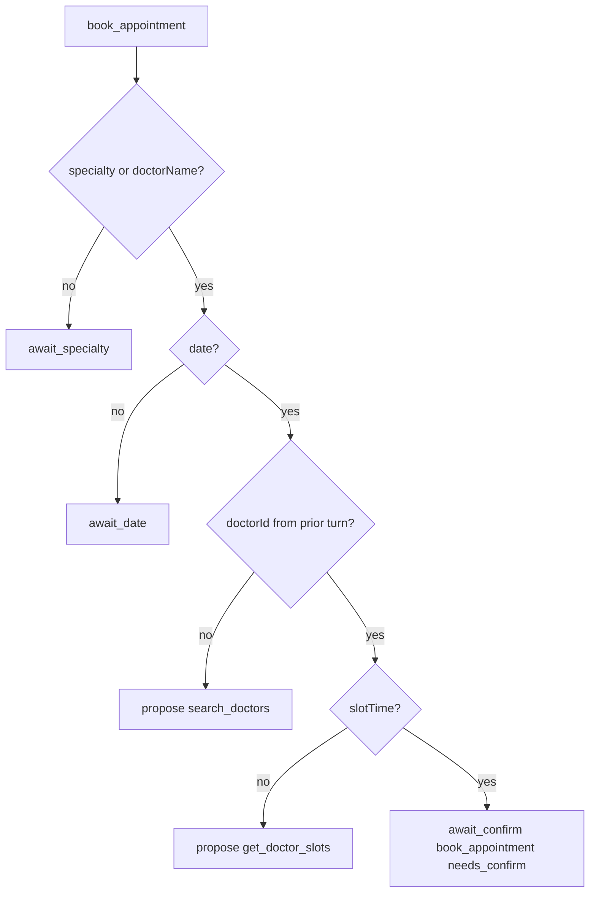
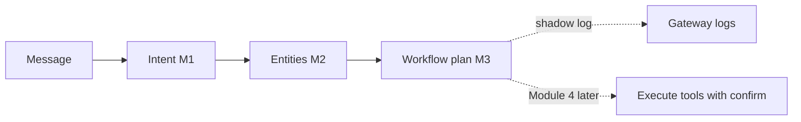

# Module 3 — Workflow Engine / Tool Router

**Plan-only** layer that turns Intent + Entities into a structured workflow plan.

**Does:** choose next step, propose tools + args from entities, ask clarification.  
**Does not:** execute tools, invent doctors/slots, mutate appointments, call LLMs.

## Public API

```python
from app.services.ai.workflow import plan_message, plan_from_handoff

result = plan_message("Book a dermatologist tomorrow morning")
print(result["plan"])
# proposed_tools: [{ name: search_doctors, args: { q: Dermatologist, date: ... } }]
```

## Booking steps



Hard rule: **never invent** `doctorId`, `slotTime`, or lab values. Those appear in `proposedArgs` only after live tool results are merged into `flow_data` by the gateway (existing booking flow).

## Pipeline



## Shadow

`AI_INTENT_ENGINE_SHADOW=true` logs `ai_workflow_shadow` (workflow, step, tools) without changing live replies.

## Tests

`tests/test_ai_workflow_engine.py`
